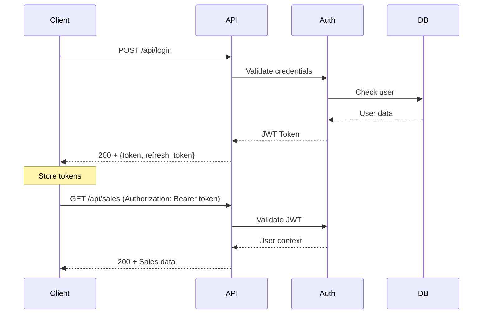

# 📋 Référence API - Maker Copilot

## 🌐 Vue d'Ensemble

L'API REST de Maker Copilot est construite avec **API Platform 3.2** et suit les standards **RESTful**. Elle fournit un accès complet aux données avec **authentification JWT** et **documentation automatique**.

## 🔗 URL de Base

```
🌍 Production: https://api.maker-copilot.com
🛠️ Development: http://localhost:8000
📚 Documentation: /api/docs
💳 Stripe Webhooks: /stripe/webhook
```

## 🔐 Authentification

### 🔑 **JWT Authentication**



### 🔑 **Endpoints d'Authentification**

#### `POST /api/login` - Connexion
```json
{
  "email": "user@example.com",
  "password": "motdepasse123"
}
```

**Réponse :**
```json
{
  "token": "eyJ0eXAiOiJKV1QiLCJhbGciOiJSUzI1NiJ9...",
  "refresh_token": "def5020096b8...",
  "user": {
    "id": 1,
    "email": "user@example.com",
    "roles": ["ROLE_USER"]
  }
}
```

#### `POST /api/token/refresh` - Renouvellement
```json
{
  "refresh_token": "def5020096b8..."
}
```

#### `POST /register` - Inscription
```json
{
  "email": "nouveau@example.com",
  "password": "motdepasse123"
}
```

## 👤 API Users

### 📊 **Endpoints Disponibles**

| Méthode | Endpoint | Description | Authentification |
|---------|----------|-------------|------------------|
| `GET` | `/api/users` | Liste des utilisateurs | ✅ Admin only |
| `GET` | `/api/users/{id}` | Détail utilisateur | ✅ Owner/Admin |
| `PUT` | `/api/users/{id}` | Modifier utilisateur | ✅ Owner only |
| `PATCH` | `/api/users/{id}` | Modification partielle | ✅ Owner only |

### 👤 **Structure User**

```json
{
  "id": 1,
  "email": "user@example.com",
  "roles": ["ROLE_USER"],
  "urssafPourcent": 22.0,
  "urssafType": 1,
  "abatementPourcent": 34.0,
  "typeSubscription": 1,
  "objectifValue": 3000,
  "createdAt": "2024-01-15T10:30:00+01:00",
  "updatedAt": "2024-01-20T14:20:00+01:00"
}
```

## 🛒 API Sales

### 📊 **Endpoints Disponibles**

| Méthode | Endpoint | Description | Filtres |
|---------|----------|-------------|---------|
| `GET` | `/api/sales` | Liste des ventes | ✅ Date, Canal |
| `GET` | `/api/sales/{id}` | Détail vente | - |
| `POST` | `/api/sales` | Créer vente | - |
| `PUT` | `/api/sales/{id}` | Modifier vente | - |
| `DELETE` | `/api/sales/{id}` | Supprimer vente | - |

### 🛒 **Structure Sale**

```json
{
  "id": 123,
  "name": "Vente Etsy - Bracelet perles",
  "price": 25.99,
  "benefit": 18.50,
  "commission": 1.30,
  "expense": 5.00,
  "ursaf": 1.19,
  "time": 2.5,
  "nbProduct": 1,
  "createdAt": "2024-01-20T14:30:00+01:00",
  "canal": {
    "id": 2,
    "name": "Etsy",
    "commission": 5.0
  },
  "salesProducts": [
    {
      "id": 456,
      "quantity": 1,
      "unitPrice": 25.99,
      "product": {
        "id": 789,
        "name": "Bracelet perles bleu"
      }
    }
  ]
}
```

### 🔍 **Filtres Disponibles**

```http
GET /api/sales?canal.id=2&createdAt[after]=2024-01-01&order[createdAt]=desc&page=1
```

| Paramètre | Type | Description | Exemple |
|-----------|------|-------------|---------|
| `canal.id` | int | Filtrer par canal | `?canal.id=2` |
| `createdAt[after]` | date | Ventes après date | `?createdAt[after]=2024-01-01` |
| `createdAt[before]` | date | Ventes avant date | `?createdAt[before]=2024-12-31` |
| `order[createdAt]` | string | Tri par date | `?order[createdAt]=desc` |
| `page` | int | Pagination | `?page=2` |
| `itemsPerPage` | int | Nb items/page | `?itemsPerPage=50` |

## 📦 API Products

### 📊 **Endpoints Disponibles**

| Méthode | Endpoint | Description | Features |
|---------|----------|-------------|----------|
| `GET` | `/api/products` | Liste produits | 🔍 Recherche, 🏷️ Catégories |
| `GET` | `/api/products/{id}` | Détail produit | 📊 Stats intégrées |
| `POST` | `/api/products` | Créer produit | 🖼️ Upload image |
| `PUT` | `/api/products/{id}` | Modifier produit | 🖼️ Update image |
| `DELETE` | `/api/products/{id}` | Supprimer produit | ⚠️ Vérif. dépendances |

### 📦 **Structure Product**

```json
{
  "id": 789,
  "name": "Bracelet perles bleu",
  "description": "Bracelet artisanal en perles de verre bleues",
  "imagePath": "/uploads/products/bracelet-bleu-123.jpg",
  "createdAt": "2024-01-10T09:00:00+01:00",
  "updatedAt": "2024-01-15T16:30:00+01:00",
  "categories": [
    {
      "id": 5,
      "name": "Bijoux",
      "color": "#3B82F6"
    }
  ],
  "prices": [
    {
      "id": 101,
      "amount": 25.99,
      "type": "public"
    },
    {
      "id": 102,
      "amount": 18.00,
      "type": "wholesale"
    }
  ]
}
```

### 🖼️ **Upload d'Image**

```http
POST /api/products/{id}/image
Content-Type: multipart/form-data

file: [image binary data]
```

**Contraintes :**
- 📏 Taille max : 5MB
- 🖼️ Formats : JPG, PNG, WEBP
- 📐 Résolution max : 2048x2048px

## 📺 API Sales Channels

### 📊 **Endpoints Standard**

```json
{
  "id": 2,
  "name": "Etsy",
  "commission": 5.0,
  "createdAt": "2024-01-01T00:00:00+01:00",
  "sales": "/api/sales_channels/2/sales"
}
```

**Canaux Typiques :**
- 🛍️ Etsy (5% commission)
- 👗 Vinted (5% commission)  
- 📱 Instagram (0% commission)
- 🌐 Site web (0% commission)
- 🏪 Marchés locaux (variable)

## 👥 API Clients

### 📊 **Structure Client**

```json
{
  "id": 456,
  "name": "Marie Dupont",
  "email": "marie.dupont@email.com",
  "phone": "+33 6 12 34 56 78",
  "address": "123 Rue de la Paix, 75001 Paris",
  "createdAt": "2024-01-05T14:20:00+01:00",
  "totalOrders": 3,
  "totalSpent": 87.50,
  "lastOrderDate": "2024-01-18T10:15:00+01:00"
}
```

## 🏷️ API Categories

### 🎨 **Structure Category**

```json
{
  "id": 5,
  "name": "Bijoux",
  "color": "#3B82F6",
  "createdAt": "2024-01-01T00:00:00+01:00",
  "productsCount": 24,
  "products": "/api/categories/5/products"
}
```

## 💸 API Spents (Dépenses)

### 💰 **Structure Spent**

```json
{
  "id": 789,
  "name": "Achat perles verre",
  "amount": 45.50,
  "type": "matiere_premiere",
  "createdAt": "2024-01-12T09:30:00+01:00"
}
```

**Types de Dépenses :**
- `matiere_premiere` : Matières premières
- `emballage` : Emballage et expédition
- `transport` : Frais de livraison
- `marketing` : Publicité et promotion
- `administratif` : Frais de gestion
- `equipement` : Outils et machines

## 📊 API Rapports

### 📈 **Endpoints Rapports**

| Endpoint | Description | Paramètres |
|----------|-------------|------------|
| `/api/rapport-data` | Données pour rapports | `type`, `period`, `filters` |
| `/api/rapports/sales-analysis` | Analyse des ventes | `startDate`, `endDate` |
| `/api/rapports/product-performance` | Performance produits | `period` |
| `/api/rapports/channel-analysis` | Analyse canaux | `channels[]` |

### 📊 **Exemple Rapport Ventes**

```http
GET /api/rapport-data?type=sales-analysis&period=month&year=2024&month=1
```

```json
{
  "period": {
    "type": "month",
    "year": 2024,
    "month": 1
  },
  "summary": {
    "totalSales": 1250.50,
    "totalBenefit": 892.30,
    "totalOrders": 45,
    "avgOrderValue": 27.79,
    "profitMargin": 71.4
  },
  "trends": {
    "salesGrowth": 15.2,
    "orderGrowth": 8.7,
    "avgOrderValueGrowth": 6.0
  },
  "topProducts": [
    {
      "productId": 789,
      "name": "Bracelet perles bleu",
      "sales": 325.75,
      "quantity": 13
    }
  ],
  "channelBreakdown": [
    {
      "channelId": 2,
      "name": "Etsy",
      "sales": 750.30,
      "percentage": 60.0
    }
  ]
}
```

## 🔍 Fonctionnalités Avancées

### 📊 **Pagination**

```json
{
  "@context": "/api/contexts/Sale",
  "@id": "/api/sales",
  "@type": "hydra:Collection",
  "hydra:member": [ /* ... */ ],
  "hydra:totalItems": 150,
  "hydra:view": {
    "@id": "/api/sales?page=1",
    "@type": "hydra:PartialCollectionView",
    "hydra:first": "/api/sales?page=1",
    "hydra:last": "/api/sales?page=6",
    "hydra:next": "/api/sales?page=2"
  }
}
```

### 🔍 **Recherche Full-Text**

```http
GET /api/products?name=bracelet&description=perles
```

### 📊 **Agrégations**

```http
GET /api/sales?groupBy=canal&aggregation=sum&field=benefit
```

### 🔄 **Relations Embarquées**

```http
GET /api/sales?include=canal,salesProducts.product
```

## ⚡ Performance & Optimisation

### 📊 **Cache HTTP**

```http
Cache-Control: public, max-age=300
ETag: "abc123def456"
Last-Modified: Mon, 20 Jan 2024 14:30:00 GMT
```

### 🚀 **Compression**

```http
Accept-Encoding: gzip, deflate, br
Content-Encoding: gzip
```

### 📱 **Rate Limiting**

```http
X-RateLimit-Limit: 1000
X-RateLimit-Remaining: 999
X-RateLimit-Reset: 1642681200
```

## ❌ Gestion d'Erreurs

### 🚨 **Codes d'Erreur Standards**

| Code | Signification | Description |
|------|---------------|-------------|
| `400` | Bad Request | Données invalides |
| `401` | Unauthorized | Token manquant/invalide |
| `403` | Forbidden | Accès refusé |
| `404` | Not Found | Ressource introuvable |
| `422` | Unprocessable Entity | Erreurs de validation |
| `429` | Too Many Requests | Rate limit dépassé |
| `500` | Internal Server Error | Erreur serveur |

### 📋 **Format d'Erreur**

```json
{
  "@context": "/api/contexts/Error",
  "@type": "hydra:Error",
  "hydra:title": "An error occurred",
  "hydra:description": "email: This value is already used.",
  "violations": [
    {
      "propertyPath": "email",
      "message": "This value is already used.",
      "code": "23bd9dbf-6b9b-41cd-a99e-4844bcf3077f"
    }
  ]
}
```

## 🔒 Sécurité

### 🛡️ **Headers de Sécurité**

```http
X-Content-Type-Options: nosniff
X-Frame-Options: DENY
X-XSS-Protection: 1; mode=block
Strict-Transport-Security: max-age=31536000
```

### 🔐 **CORS Configuration**

```http
Access-Control-Allow-Origin: https://app.maker-copilot.com
Access-Control-Allow-Methods: GET, POST, PUT, PATCH, DELETE
Access-Control-Allow-Headers: Content-Type, Authorization
```

### 👤 **Isolation des Données**

Toutes les ressources sont **automatiquement filtrées** par utilisateur connecté. Un utilisateur ne peut accéder qu'à ses propres données.

## 💳 API Abonnements

### 📄 **Gestion des Abonnements**

| Endpoint | Méthode | Description | Permissions |
|----------|---------|-------------|-------------|
| `/api/subscriptions` | `GET` | Liste des abonnements | `ROLE_USER` |
| `/api/subscriptions/current` | `GET` | Abonnement actuel + limites | `ROLE_USER` |
| `/api/subscriptions/create-checkout` | `POST` | Créer session Stripe | `ROLE_USER` |
| `/api/subscriptions/{id}/cancel` | `POST` | Annuler abonnement | `ROLE_USER` |
| `/api/subscriptions/{id}/change-plan` | `POST` | Changer de plan | `ROLE_USER` |
| `/api/subscriptions/customer-portal` | `POST` | Portal client Stripe | `ROLE_USER` |
| `/api/subscriptions/check-limits` | `GET` | Vérifier limites plan | `ROLE_USER` |

#### 🛒 **Créer Session Checkout**

```http
POST /api/subscriptions/create-checkout
Authorization: Bearer {jwt_token}
Content-Type: application/json

{
  "plan_slug": "pro",
  "billing_interval": "year",
  "success_url": "https://app.example.com/success",
  "cancel_url": "https://app.example.com/cancel"
}
```

**Réponse 200:**
```json
{
  "checkout_url": "https://checkout.stripe.com/pay/...",
  "session_id": "cs_test_..."
}
```

#### 📊 **Abonnement Actuel**

```http
GET /api/subscriptions/current
Authorization: Bearer {jwt_token}
```

**Réponse 200:**
```json
{
  "subscription": {
    "id": 123,
    "status": "active",
    "plan": {
      "slug": "pro",
      "name": "Plan Pro",
      "price_monthly": 5.00,
      "price_yearly": 55.00
    },
    "current_period_start": "2024-01-01T00:00:00Z",
    "current_period_end": "2024-02-01T00:00:00Z",
    "billing_interval": "month"
  },
  "plan_limits": {
    "max_products": 50,
    "has_detailed_reports": true,
    "current_products": 12,
    "can_create_products": true,
    "is_unlimited": false
  },
  "user_stats": {
    "products_count": 12,
    "sales_count": 156
  }
}
```

#### ❌ **Annuler Abonnement**

```http
POST /api/subscriptions/123/cancel
Authorization: Bearer {jwt_token}
Content-Type: application/json

{
  "at_period_end": true
}
```

### 📃 **API Factures**

| Endpoint | Méthode | Description | Permissions |
|----------|---------|-------------|-------------|
| `/api/invoices` | `GET` | Liste des factures | `ROLE_USER` |
| `/api/invoices/{id}` | `GET` | Détails d'une facture | `ROLE_USER` |
| `/api/invoices/{id}/download` | `GET` | Liens de téléchargement | `ROLE_USER` |
| `/api/invoices/{id}/sync` | `POST` | Synchroniser avec Stripe | `ROLE_USER` |
| `/api/invoices/stats` | `GET` | Statistiques factures | `ROLE_USER` |

#### 📋 **Liste des Factures**

```http
GET /api/invoices?page=1&limit=20&status=paid
Authorization: Bearer {jwt_token}
```

**Réponse 200:**
```json
{
  "invoices": [
    {
      "id": 456,
      "invoice_number": "1234-5678",
      "status": "paid",
      "total": 5.00,
      "amount_paid": 5.00,
      "currency": "EUR",
      "due_date": "2024-01-15T00:00:00Z",
      "paid_at": "2024-01-10T14:30:00Z",
      "hosted_invoice_url": "https://invoice.stripe.com/..."
    }
  ],
  "pagination": {
    "page": 1,
    "limit": 20,
    "total": 45,
    "pages": 3
  }
}
```

### 💳 **API Moyens de Paiement**

| Endpoint | Méthode | Description | Permissions |
|----------|---------|-------------|-------------|
| `/api/payment-methods` | `GET` | Liste des moyens | `ROLE_USER` |
| `/api/payment-methods` | `POST` | Ajouter moyen | `ROLE_USER` |
| `/api/payment-methods/{id}` | `GET` | Détails moyen | `ROLE_USER` |
| `/api/payment-methods/{id}/set-default` | `POST` | Définir par défaut | `ROLE_USER` |
| `/api/payment-methods/{id}` | `DELETE` | Supprimer moyen | `ROLE_USER` |

#### 💳 **Ajouter Moyen de Paiement**

```http
POST /api/payment-methods
Authorization: Bearer {jwt_token}
Content-Type: application/json

{
  "payment_method_id": "pm_test_..."
}
```

**Note:** `payment_method_id` est obtenu via Stripe Elements côté frontend.

### 🔗 **Webhooks Stripe**

```http
POST /stripe/webhook
Stripe-Signature: t=...,v1=...
Content-Type: application/json

{
  "id": "evt_...",
  "type": "checkout.session.completed",
  "data": {
    "object": {
      "id": "cs_...",
      "subscription": "sub_...",
      "metadata": {
        "user_id": "123",
        "plan_id": "456"
      }
    }
  }
}
```

**Événements supportés:**
- `checkout.session.completed`
- `customer.subscription.created`
- `customer.subscription.updated`
- `customer.subscription.deleted`
- `invoice.payment_succeeded`
- `invoice.payment_failed`
- `invoice.created`
- `customer.subscription.trial_will_end`

### 🔒 **Système de Permissions**

#### Vérification des Limites

```http
GET /api/subscriptions/check-limits?action=create_product
Authorization: Bearer {jwt_token}
```

**Réponse 200:**
```json
{
  "plan_limits": {
    "max_products": 50,
    "has_detailed_reports": true,
    "current_products": 12,
    "can_create_products": true
  },
  "allowed": true,
  "message": null
}
```

**Actions supportées:**
- `create_product` - Création de produit
- `detailed_reports` - Accès rapports détaillés

#### Codes d'Erreur Spécifiques

```json
{
  "error": "Limite de produits atteinte pour votre plan",
  "code": "SUBSCRIPTION_LIMIT_REACHED",
  "current_limit": 3,
  "current_usage": 3,
  "upgrade_required": true
}
```

---

> 💡 **Documentation Interactive** : Accédez à `/api/docs` pour une documentation Swagger complète avec possibilité de tester directement les endpoints !