# 🏛️ Architecture Générale - Maker Copilot

## 📋 Vue d'Ensemble

Maker Copilot est construit sur une **architecture moderne** basée sur Symfony 6.4 avec API Platform, suivant les principes **DDD (Domain Driven Design)** et **Clean Architecture**.

## 🏗️ Architecture Globale

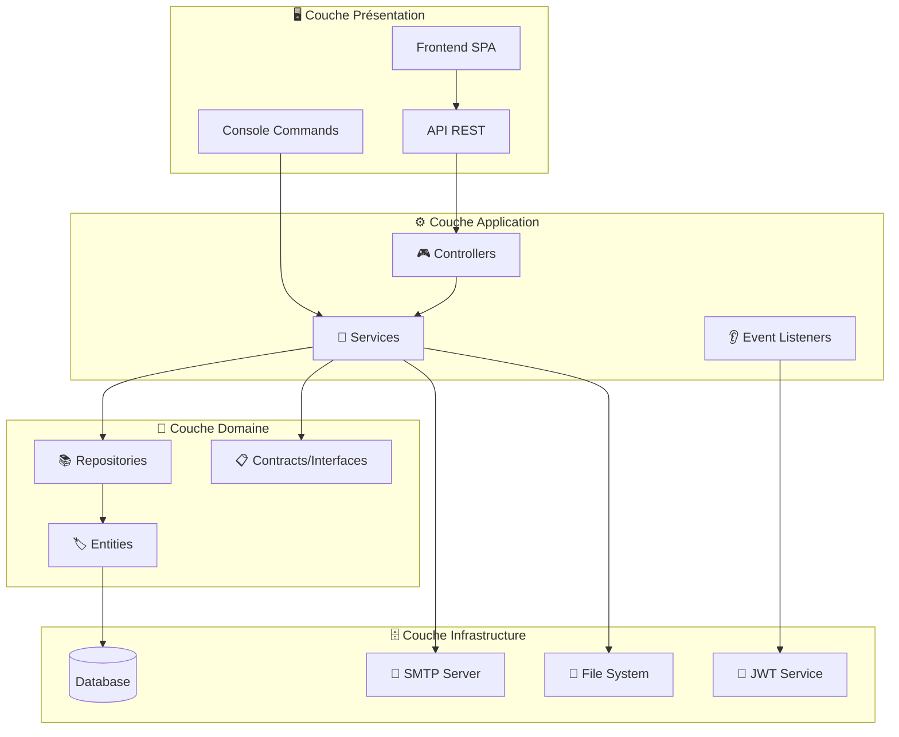

## 📁 Structure des Dossiers

```
src/
├── 🎮 Controller/           # Contrôleurs API REST
├── 🏷️ Entity/              # Entités Doctrine
├── 📚 Repository/           # Repositories Doctrine
├── 🔧 Service/              # Services métier
├── 📋 Contracts/            # Interfaces et contrats
├── 🎭 State/                # State processors API Platform
├── 👂 EventListener/        # Event listeners
├── 🗂️ Model/               # Modèles de données
├── 🚀 ApiResource/          # Ressources API Platform
├── ⚡ Command/              # Commandes console
├── 📊 Scheduler/            # Tâches programmées
└── 🔧 Doctrine/             # Extensions Doctrine
```

## 🎯 Patterns Architecturaux Utilisés

### 1. 🎭 **Strategy Pattern**
Utilisé pour le système de génération de rapports :

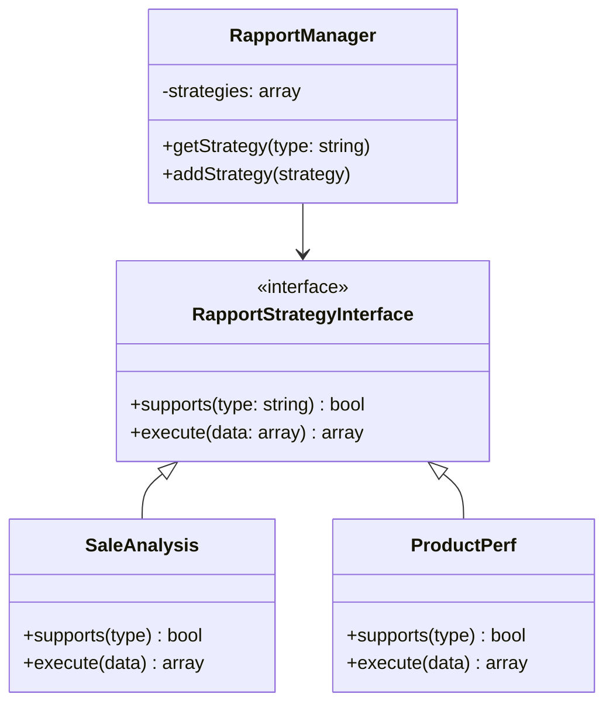

### 2. 🏭 **Repository Pattern**
Encapsulation de la logique d'accès aux données :

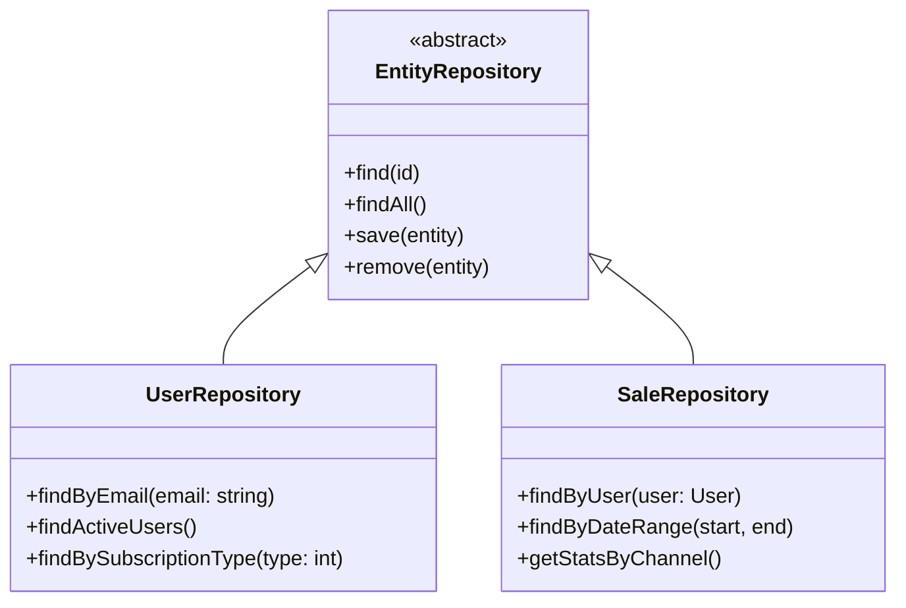

### 3. 🔧 **Dependency Injection**
Services injectés via le container Symfony :

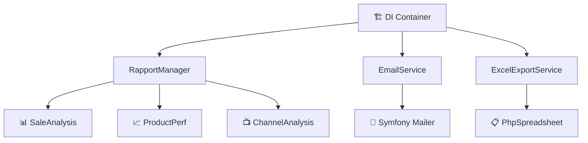

## 🌐 Architecture API

### 📡 **RESTful API avec API Platform**

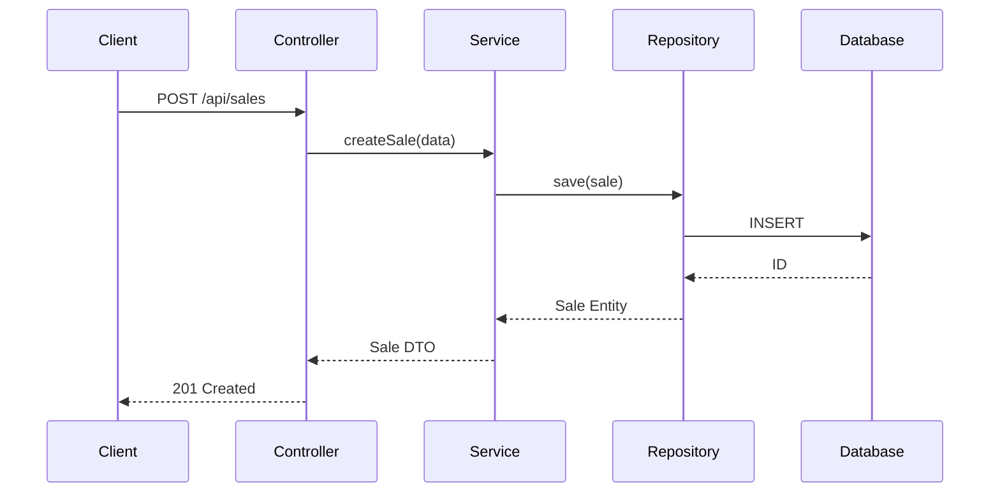

### 🔐 **Authentification JWT**

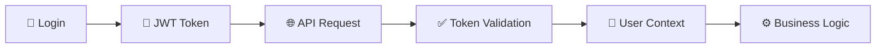

## 🗄️ Architecture de Données

### 📊 **Modèle de Données Principal**

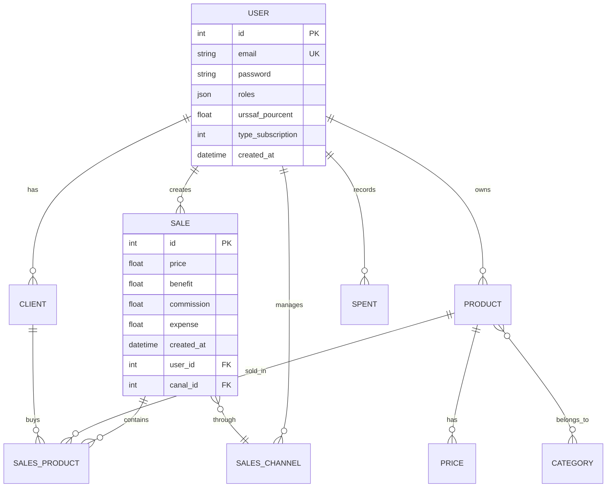

### 📈 **Vues SQL pour Analytics**

Le système utilise 21 vues SQL optimisées pour les rapports :

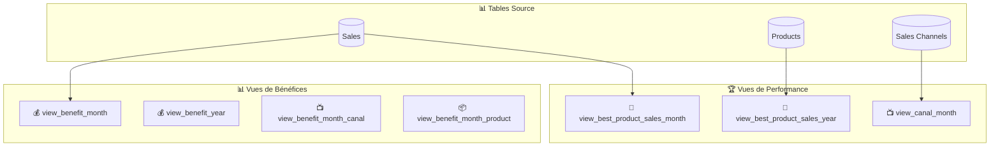

## 🔧 Services & Composants

### 📈 **Système de Rapports**

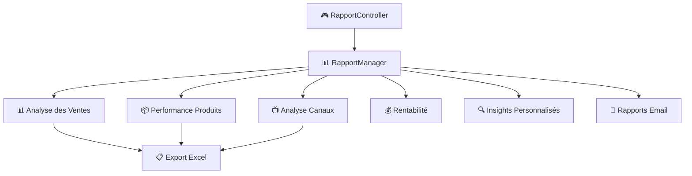

### 📧 **Système d'Email**

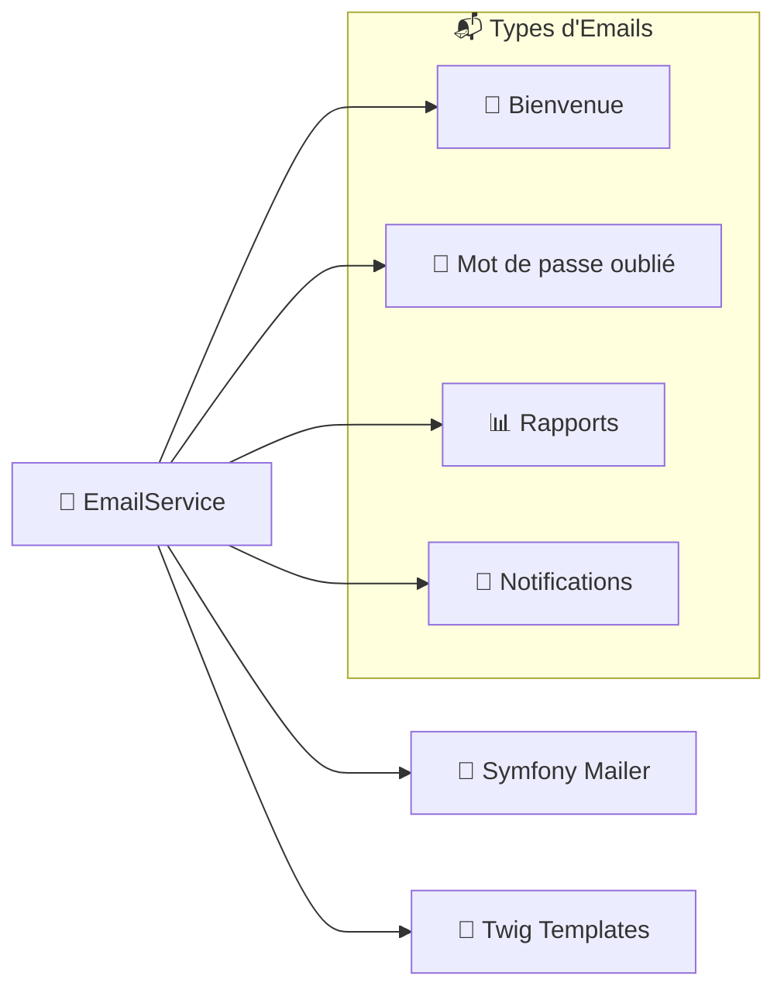

## 🔒 Sécurité

### 🛡️ **Couches de Sécurité**

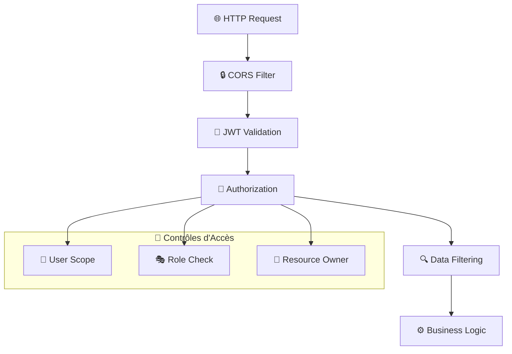

### 🔍 **Filtrage Automatique des Données**

```php
// Extension Doctrine pour filtrer automatiquement par utilisateur
class CurrentUserExtension implements QueryCollectionExtensionInterface
{
    public function applyToCollection(/* ... */)
    {
        $this->addWhere($queryBuilder, 'o.user = :current_user');
    }
}
```

## ⚡ Performance & Optimisation

### 📊 **Stratégies d'Optimisation**

1. **🚀 Eager Loading** : Configuration API Platform avec max 9000 joins
2. **📱 Pagination** : Pagination configurée (max 1000 items)
3. **🗄️ Vues SQL** : Pré-calculs pour les rapports complexes
4. **💾 Cache** : Cache Symfony pour les données statiques
5. **📊 Indexation** : Index sur les colonnes fréquemment utilisées

### 📈 **Monitoring & Observabilité**

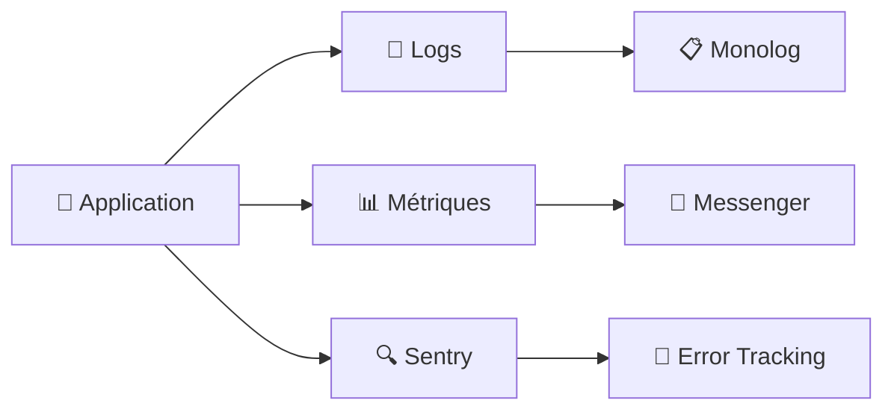

## 🚀 Évolutivité

### 📈 **Axes d'Évolution**

1. **🔄 Microservices** : Possibilité de découper en services
2. **📊 Event Sourcing** : Pour l'historique des modifications
3. **🚀 CQRS** : Séparation lecture/écriture pour les rapports
4. **☁️ Cloud Native** : Déploiement containerisé

### 🏗️ **Architecture Future**

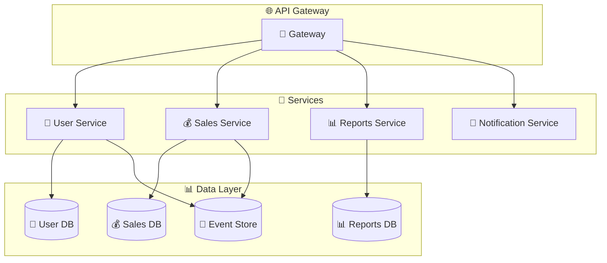

---

> 💡 **Note** : Cette architecture est conçue pour être **évolutive** et **maintenable**, permettant une croissance progressive du projet tout en conservant la qualité du code.