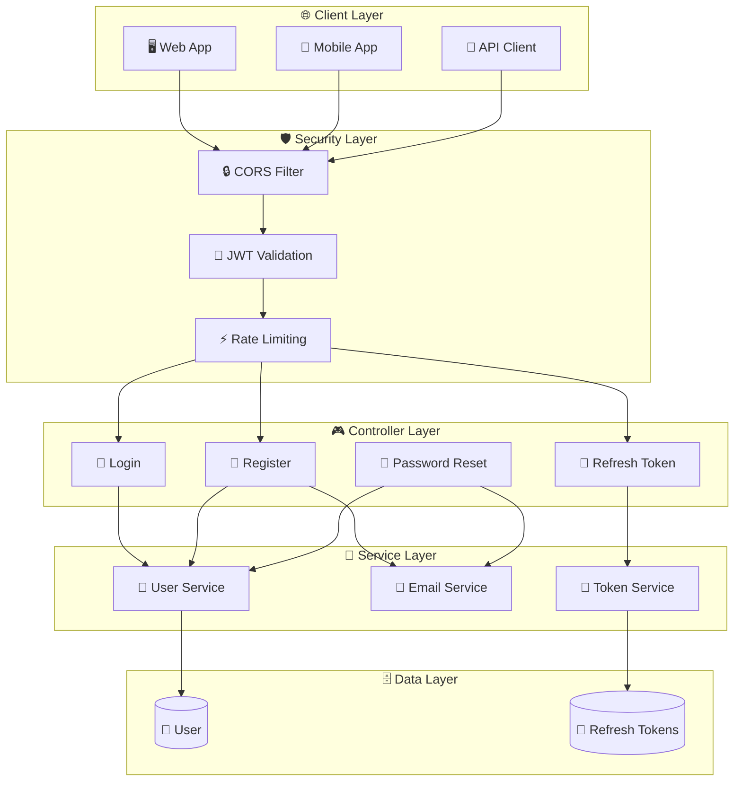
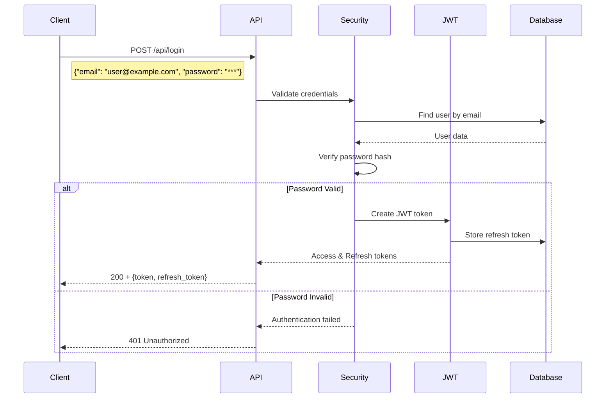
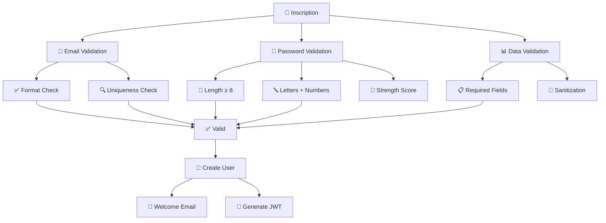
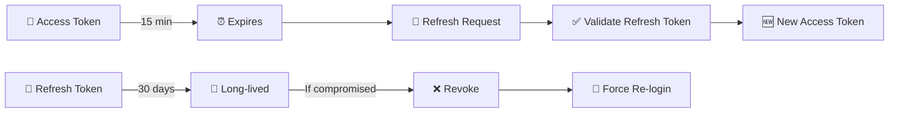
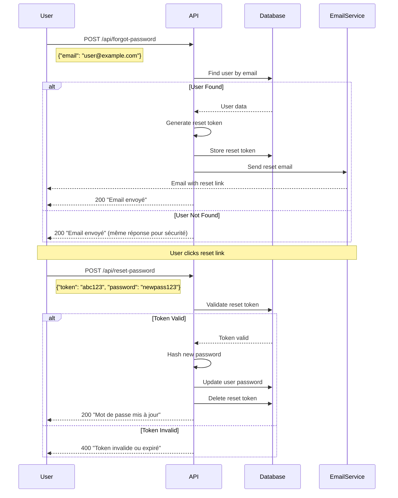
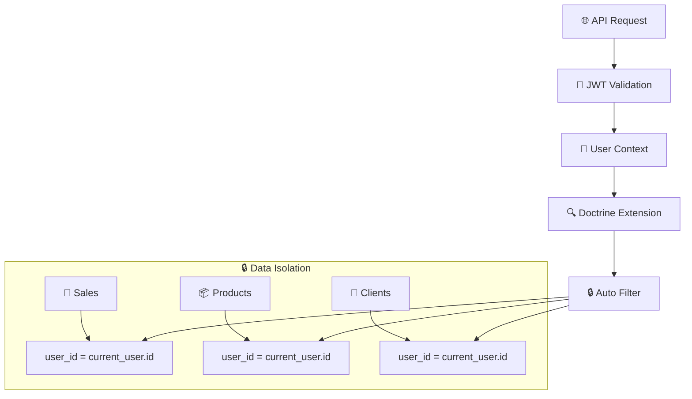
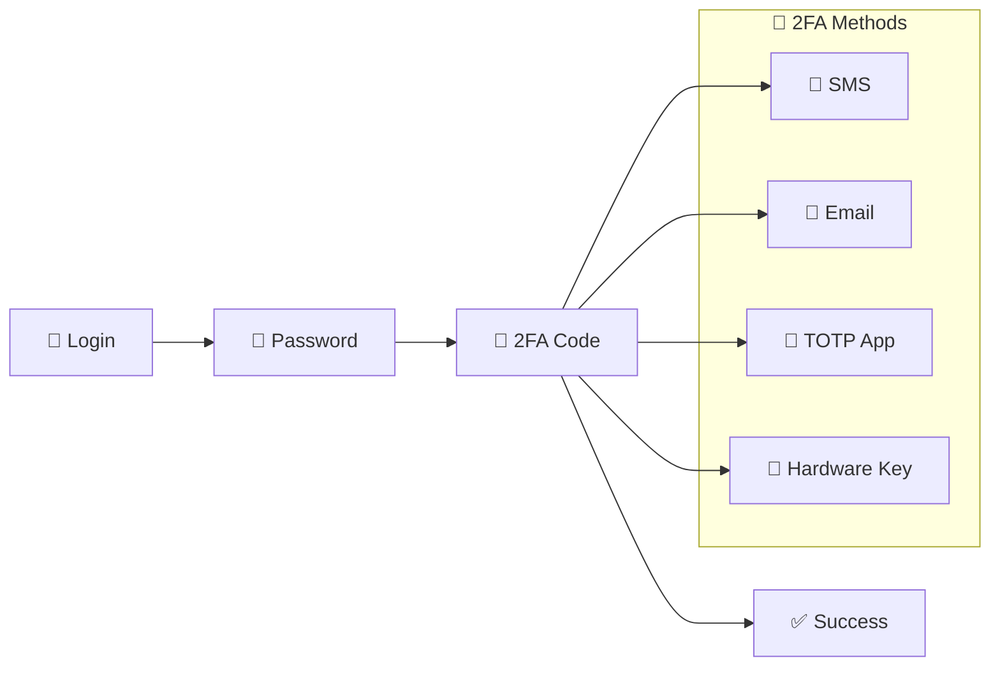
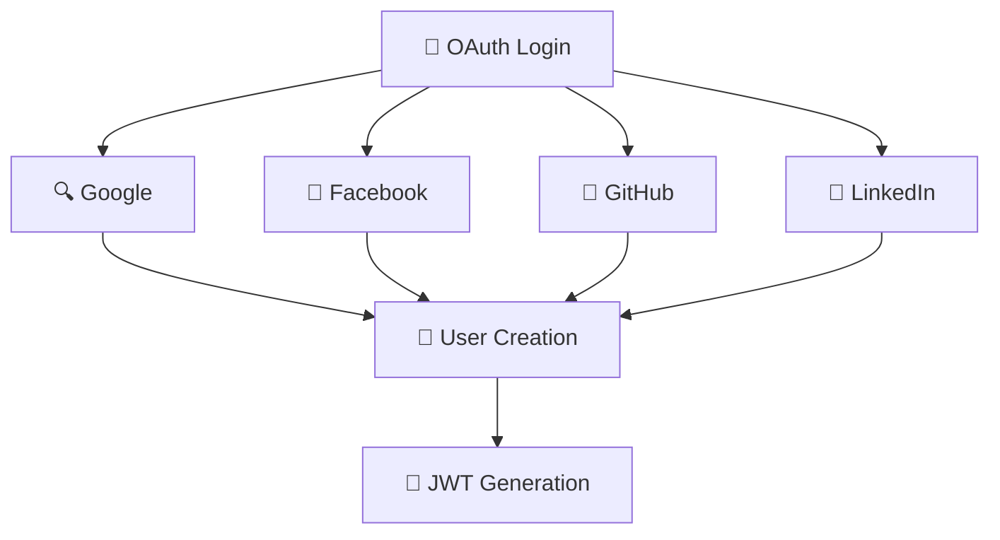

# 🔐 Authentification & Sécurité - Maker Copilot

## 🛡️ Vue d'Ensemble

Maker Copilot implémente un système d'authentification **JWT robuste** avec gestion des refresh tokens, validation renforcée et isolation complète des données utilisateur.

## 🔑 Architecture d'Authentification



## 🔐 JWT Authentication Flow

### 🔑 **Processus de Connexion**



### 🎫 **Structure du JWT Token**

```json
{
  "header": {
    "typ": "JWT",
    "alg": "RS256"
  },
  "payload": {
    "iat": 1642681200,
    "exp": 1642684800,
    "roles": ["ROLE_USER"],
    "username": "user@example.com",
    "id": 123,
    "urssaf_pourcent": 22.0,
    "abatement_pourcent": 34.0,
    "urssaf_type": 1,
    "objectif_value": 3000,
    "type_subscription": 1
  },
  "signature": "eyJhbGciOiJSUzI1NiJ9..."
}
```

## 📝 Système d'Inscription

### ✅ **Validation Renforcée**



### 🔐 **Validation des Mots de Passe**

```php
// Constraints de validation
$passwordConstraints = [
    new Assert\NotBlank(['message' => 'Le mot de passe ne peut pas être vide']),
    new Assert\Length([
        'min' => 8,
        'minMessage' => 'Le mot de passe doit contenir au moins {{ limit }} caractères'
    ]),
    new Assert\Regex([
        'pattern' => '/^(?=.*[A-Za-z])(?=.*\d).+$/',
        'message' => 'Le mot de passe doit contenir au moins une lettre et un chiffre'
    ])
];
```

**Règles de sécurité :**
- 📏 **Longueur minimum** : 8 caractères
- 🔤 **Complexité** : Au moins 1 lettre ET 1 chiffre
- 🚫 **Blacklist** : Mots de passe courants interdits
- 🔄 **Hashing** : Bcrypt avec salt automatique

## 🔄 Refresh Token System

### 🎫 **Gestion des Tokens**



### 🔧 **Configuration des Tokens**

```yaml
# config/packages/lexik_jwt_authentication.yaml
lexik_jwt_authentication:
    secret_key: '%env(resolve:JWT_SECRET_KEY)%'
    public_key: '%env(resolve:JWT_PUBLIC_KEY)%'
    pass_phrase: '%env(JWT_PASSPHRASE)%'
    token_ttl: 900  # 15 minutes
    user_identity_field: email

# config/packages/gesdinet_jwt_refresh_token.yaml
gesdinet_jwt_refresh_token:
    refresh_token_class: App\Entity\RefreshToken
    ttl: 2592000  # 30 days
    ttl_update: true
```

### 📊 **Entité RefreshToken**

```php
#[ORM\Entity]
class RefreshToken extends BaseRefreshToken
{
    #[ORM\Id]
    #[ORM\GeneratedValue]
    #[ORM\Column(type: 'integer')]
    protected $id;

    #[ORM\Column(type: 'string')]
    protected $refreshToken;

    #[ORM\Column(type: 'string')]
    protected $username;

    #[ORM\Column(type: 'datetime')]
    protected $valid;
}
```

## 🔑 Mot de Passe Oublié

### 🔄 **Workflow de Récupération**



### 🛡️ **Sécurité du Reset**

```php
class ResetPasswordService
{
    private const TOKEN_EXPIRY = 3600; // 1 heure
    
    public function generateResetToken(User $user): string
    {
        $token = bin2hex(random_bytes(32)); // Token cryptographiquement sûr
        $hashedToken = password_hash($token, PASSWORD_DEFAULT);
        
        $user->setResetToken($hashedToken);
        $user->setResetTokenExpiresAt(new \DateTime('+1 hour'));
        
        return $token; // Retourne le token non-hashé pour l'email
    }
    
    public function validateResetToken(string $token, User $user): bool
    {
        if (!$user->getResetToken() || !$user->getResetTokenExpiresAt()) {
            return false;
        }
        
        if ($user->getResetTokenExpiresAt() < new \DateTime()) {
            return false; // Token expiré
        }
        
        return password_verify($token, $user->getResetToken());
    }
}
```

## 🛡️ Configuration de Sécurité

### 🔒 **Security Bundle Configuration**

```yaml
# config/packages/security.yaml
security:
  enable_authenticator_manager: true
  
  password_hashers:
    Symfony\Component\Security\Core\User\PasswordAuthenticatedUserInterface: 'auto'
  
  providers:
    users:
      entity:
        class: App\Entity\User
        property: email
  
  firewalls:
    dev:
      pattern: ^/(_(profiler|wdt)|css|images|js)/
      security: false
    
    login:
      pattern: ^/api/login
      stateless: true
      json_login:
        check_path: /api/login
        success_handler: lexik_jwt_authentication.handler.authentication_success
        failure_handler: lexik_jwt_authentication.handler.authentication_failure
    
    api:
      pattern: ^/api
      stateless: true
      jwt: ~
  
  access_control:
    - { path: ^/api/login, roles: PUBLIC_ACCESS }
    - { path: ^/api/register, roles: PUBLIC_ACCESS }
    - { path: ^/api/forgot-password, roles: PUBLIC_ACCESS }
    - { path: ^/api/reset-password, roles: PUBLIC_ACCESS }
    - { path: ^/api/token/refresh, roles: PUBLIC_ACCESS }
    - { path: ^/api, roles: IS_AUTHENTICATED_FULLY }
```

### 🌐 **CORS Configuration**

```yaml
# config/packages/nelmio_cors.yaml
nelmio_cors:
    defaults:
        origin_regex: true
        allow_origin: ['%env(CORS_ALLOW_ORIGIN)%']
        allow_methods: ['GET', 'OPTIONS', 'POST', 'PUT', 'PATCH', 'DELETE']
        allow_headers: ['Content-Type', 'Authorization', 'X-Requested-With']
        expose_headers: ['Link']
        max_age: 3600
    paths:
        '^/api/':
            allow_origin: ['*']
            allow_headers: ['*']
            allow_methods: ['POST', 'PUT', 'GET', 'DELETE', 'PATCH', 'OPTIONS']
            max_age: 3600
```

## 👤 Isolation des Données

### 🔍 **Filtre Automatique par Utilisateur**

```php
// src/Doctrine/CurrentUserExtension.php
class CurrentUserExtension implements QueryCollectionExtensionInterface
{
    public function __construct(
        private Security $security,
        private ReflectionExtractor $reflectionExtractor
    ) {}
    
    public function applyToCollection(
        QueryBuilder $queryBuilder,
        QueryNameGeneratorInterface $queryNameGenerator,
        string $resourceClass,
        Operation $operation = null,
        array $context = []
    ): void {
        $this->addWhere($queryBuilder, $resourceClass);
    }
    
    private function addWhere(QueryBuilder $queryBuilder, string $resourceClass): void
    {
        $user = $this->security->getUser();
        if (!$user instanceof User) {
            return;
        }
        
        // Skip pour l'entité User elle-même
        if ($resourceClass === User::class) {
            return;
        }
        
        // Vérifier si l'entité a une propriété 'user'
        $properties = $this->reflectionExtractor->getProperties($resourceClass) ?? [];
        if (in_array('user', $properties, true)) {
            $rootAlias = $queryBuilder->getRootAliases()[0];
            $queryBuilder->andWhere(sprintf('%s.user = :current_user', $rootAlias))
                        ->setParameter('current_user', $user);
        }
    }
}
```

### 🛡️ **Sécurité au Niveau Entité**



## 🔐 Event Listeners

### 🎫 **JWT Created Listener**

```php
// src/EventListener/JWTCreatedListener.php
class JWTCreatedListener
{
    public function onJWTCreated(JWTCreatedEvent $event): void
    {
        $user = $event->getUser();
        $payload = $event->getData();
        
        // Ajouter des données utilisateur au token
        $payload['id'] = $user->getId();
        $payload['urssaf_pourcent'] = $user->getUrssafPourcent();
        $payload['abatement_pourcent'] = $user->getAbatementPourcent();
        $payload['urssaf_type'] = $user->getUrssafType();
        $payload['objectif_value'] = $user->getObjectifValue();
        $payload['type_subscription'] = $user->getTypeSubscription();
        
        $event->setData($payload);
    }
}
```

## 📊 Audit et Logging

### 📝 **Logging de Sécurité**

```php
// Dans les contrôleurs d'authentification
$this->logger->info('Tentative de connexion', [
    'email' => $data['email'],
    'ip' => $request->getClientIp(),
    'user_agent' => $request->headers->get('User-Agent')
]);

$this->logger->warning('Échec de connexion', [
    'email' => $data['email'],
    'reason' => 'invalid_credentials',
    'ip' => $request->getClientIp()
]);
```

### 📊 **Métriques de Sécurité**

| Métrique | Description | Seuil d'Alerte |
|----------|-------------|----------------|
| 🔑 **Failed Logins** | Tentatives échouées | > 10/heure/IP |
| 🎫 **Token Refresh Rate** | Fréquence de refresh | > 1000/heure |
| 📧 **Password Resets** | Demandes de reset | > 50/heure |
| 🚫 **Blocked IPs** | IPs bloquées | > 5/jour |

## 🚀 Améliorations Futures

### 🔒 **Authentification Multi-Facteurs (2FA)**



### 🔐 **Authentification OAuth**



---

> 🔒 **Sécurité First** : Le système d'authentification de Maker Copilot suit les **meilleures pratiques** de sécurité avec isolation complète des données et validation renforcée à tous les niveaux.