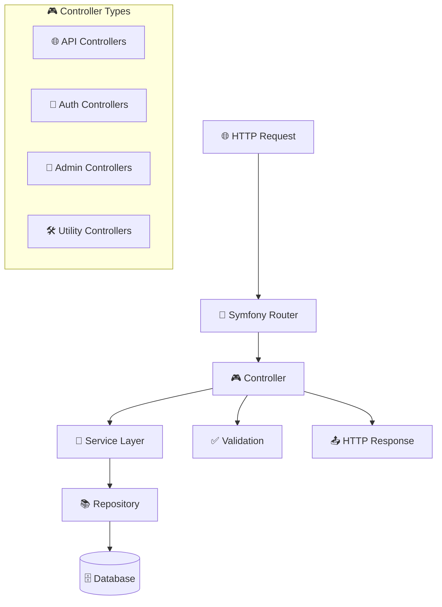
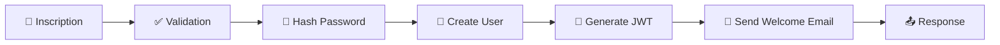
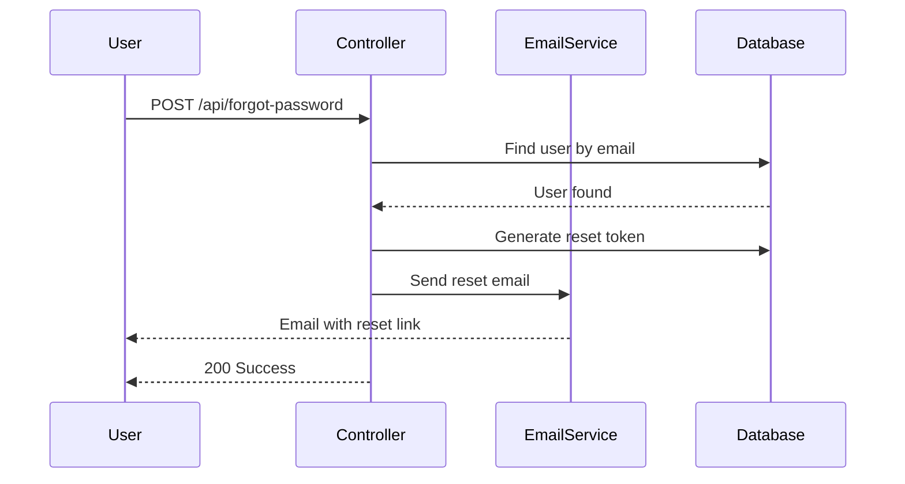
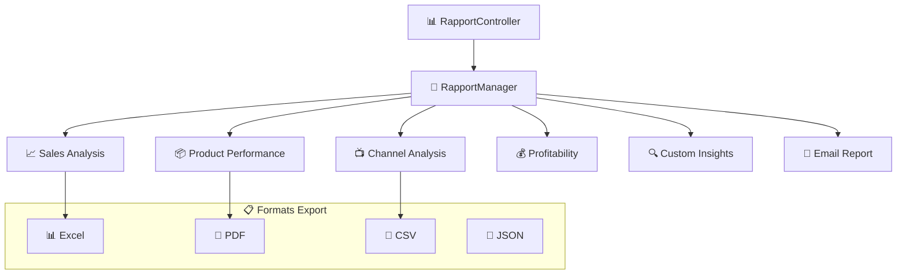
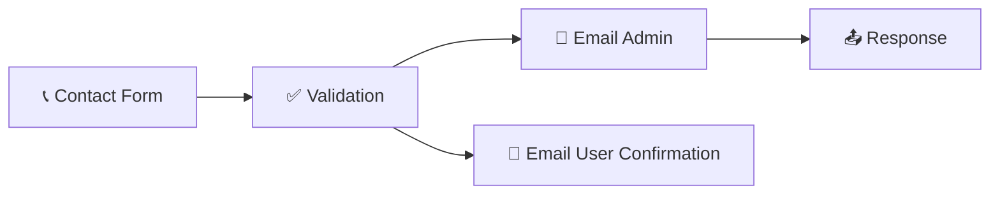
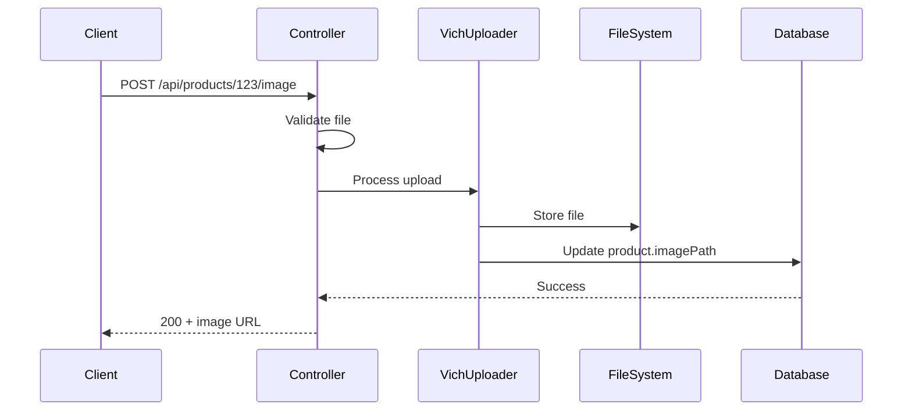
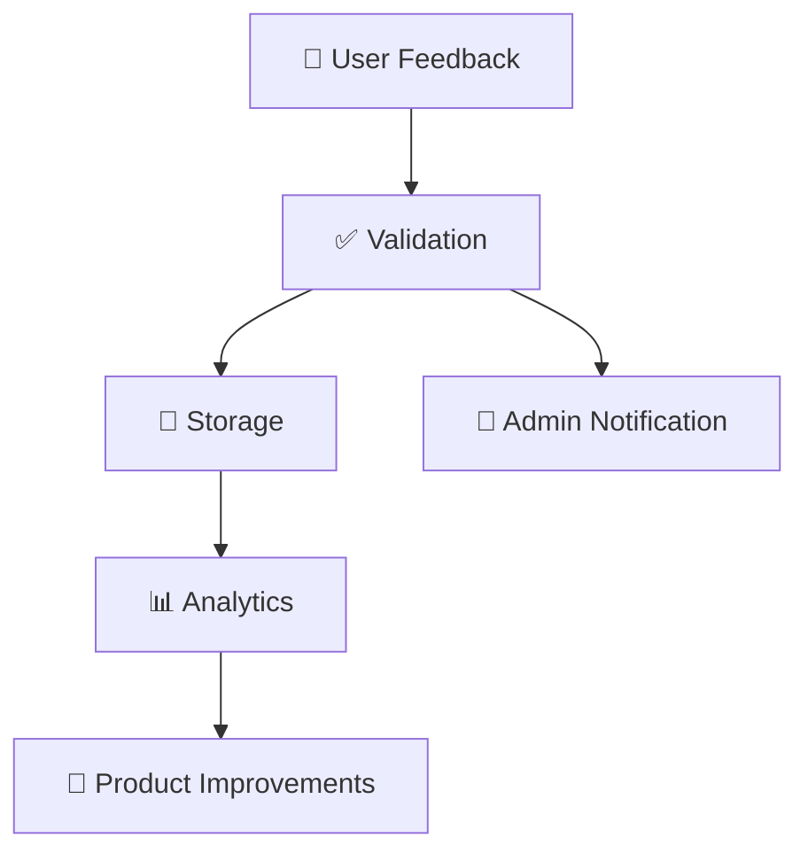
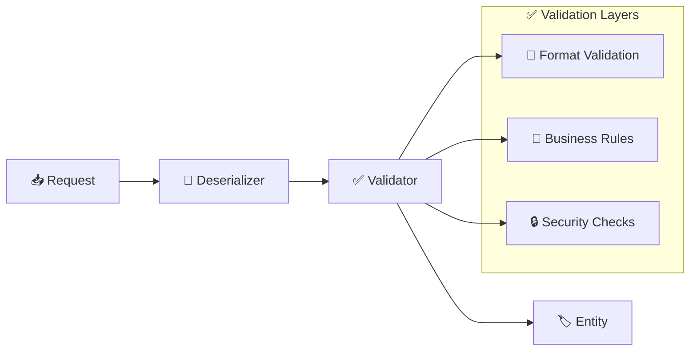
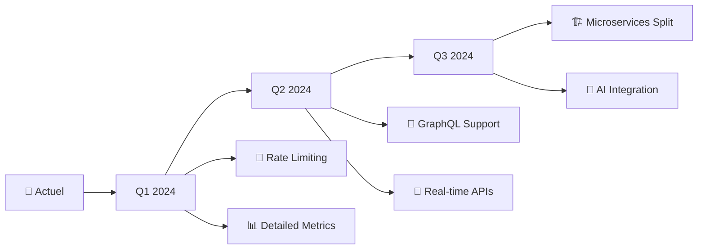

# 🎮 Contrôleurs - Maker Copilot

## 📋 Vue d'Ensemble

Les contrôleurs de Maker Copilot gèrent la **logique de présentation** et orchestrent les interactions entre l'API et les services métier. Ils sont organisés par **domaine fonctionnel**.

## 🏗️ Architecture des Contrôleurs



## 👤 Contrôleurs d'Authentification

### 🔐 `RegistrationController` - Inscription

**Fichier :** `src/Controller/RegistrationController.php`

```php
#[Route('/register', name: 'register', methods: 'POST')]
public function register(Request $request, MailerInterface $mailer): JsonResponse
```

#### ✨ **Fonctionnalités**



#### 🛡️ **Validations Implémentées**

| Validation | Description | Règle |
|------------|-------------|-------|
| 📧 **Email** | Format valide et unique | `Assert\Email`, vérification unicité |
| 🔐 **Password** | Force du mot de passe | 8 chars min, lettres + chiffres |
| 🔍 **Data** | Présence des champs | `email` et `password` requis |

#### 📧 **Gestion Email**

```php
try {
    $htmlContent = $this->renderView('email/welcome.html.twig', [
        'email' => $user->getEmail()
    ]);
    $mailer->send($email);
    $this->logger->info('Email de bienvenue envoyé');
} catch (\Exception $e) {
    // Log erreur mais ne bloque pas la création
    $this->logger->error('Erreur email: ' . $e->getMessage());
}
```

### 🔑 `ForgotPasswordController` - Mot de Passe Oublié

**Workflow :**



### 🔄 `ResetPasswordController` - Réinitialisation

**Features :**
- 🔐 Validation du token de reset
- ⏰ Expiration des tokens (24h)
- 🔒 Hash sécurisé du nouveau mot de passe
- 🗑️ Suppression automatique du token

## 📊 Contrôleurs de Rapports

### 📈 `RapportController` - Génération de Rapports

**Fichier :** `src/Controller/RapportController.php`

```php
#[Route('/api/rapports/{type}', name: 'generate_rapport')]
public function generateRapport(string $type, Request $request): JsonResponse
```

#### 🎯 **Types de Rapports Supportés**



#### 🔧 **Implémentation Strategy Pattern**

```php
public function generateRapport(string $type, Request $request): JsonResponse
{
    try {
        $strategy = $this->rapportManager->getStrategy($type);
        $data = $request->query->all();
        
        $result = $strategy->execute($data);
        
        return new JsonResponse($result, Response::HTTP_OK);
    } catch (\DomainException $e) {
        return new JsonResponse([
            'error' => 'Type de rapport non supporté'
        ], Response::HTTP_BAD_REQUEST);
    }
}
```

### 📊 `RapportDataController` - Données pour Dashboard

**API Resource personnalisée :**

```php
#[ApiResource(
    operations: [
        new Get(controller: RapportDataController::class)
    ]
)]
class RapportData
```

## 📧 Contrôleurs de Communication

### ✉️ `EmailTestController` - Tests d'Email

**Fonctionnalités :**
- 🧪 Test de configuration SMTP
- 📧 Envoi d'emails de test
- 📊 Diagnostic de configuration
- 🔍 Validation des templates

```php
#[Route('/api/test-email', name: 'test_email', methods: ['POST'])]
public function testEmail(Request $request, MailerInterface $mailer): JsonResponse

#[Route('/api/email-config', name: 'email_config', methods: ['GET'])]
public function getEmailConfig(): JsonResponse
```

### 📞 `ContactHomeController` - Contact Général

**Gestion des demandes de contact :**



### 🧪 `ContactTesteurController` - Contact Testeurs

**Spécifique aux demandes de programme testeur :**
- 🎯 Formulaire spécialisé
- 📊 Métriques dédiées
- 🔄 Workflow d'approbation

## 🖼️ Contrôleurs de Gestion de Fichiers

### 📸 `ProductImageController` - Images Produits

**Fichier :** `src/Controller/ProductImageController.php`

```php
#[Route('/api/products/{id}/image', methods: ['POST'])]
public function uploadImage(Product $product, Request $request): JsonResponse
```

#### 🔄 **Workflow Upload**



#### 🛡️ **Validations d'Upload**

| Validation | Règle | Erreur |
|------------|-------|--------|
| 📏 **Taille** | Max 5MB | `413 Payload Too Large` |
| 🖼️ **Format** | JPG, PNG, WEBP | `422 Unprocessable Entity` |
| 📐 **Dimensions** | Max 2048x2048 | `422 Unprocessable Entity` |
| 🔒 **Sécurité** | Scan antivirus | `422 Unprocessable Entity` |

## 📮 Contrôleurs de Monitoring

### 📊 `MessengerMonitorController` - Monitoring des Queues

**Surveillance des tâches asynchrones :**

```php
#[Route('/admin/messenger/monitor')]
public function monitor(): Response
```

**Métriques suivies :**
- 📊 Nombre de messages en attente
- ⚡ Temps de traitement moyen
- ❌ Taux d'erreur
- 🔄 Tentatives de retry

### 💬 `FeedBackController` - Retours Utilisateurs

**Collecte des feedbacks :**



## 🔒 Middleware et Sécurité

### 🛡️ **JWT Authentication**

```php
// Gestion automatique par LexikJWTAuthenticationBundle
// Configuration dans security.yaml
```

### 👤 **User Context Injection**

```php
class CurrentUserExtension implements QueryCollectionExtensionInterface
{
    public function applyToCollection(QueryBuilder $qb, ...)
    {
        // Filtre automatique par utilisateur connecté
        $qb->andWhere('o.user = :current_user')
           ->setParameter('current_user', $this->security->getUser());
    }
}
```

### 🔍 **Validation des Données**



## ⚡ Performance et Optimisation

### 📊 **Cache des Réponses**

```php
#[Cache(expires: '+1 hour', public: true)]
public function getPublicData(): JsonResponse
```

### 🔄 **Pagination Optimisée**

```php
// Configuration API Platform
paginationClientItemsPerPage: true
paginationMaximumItemsPerPage: 1000
```

### 📱 **Compression des Réponses**

```php
// Compression automatique via Symfony
// Configuration dans framework.yaml
```

## 🧪 Tests et Validation

### 🔍 **Validation des Contrôleurs**

```php
// Tests fonctionnels avec WebTestCase
class RegistrationControllerTest extends WebTestCase
{
    public function testSuccessfulRegistration()
    {
        $client = static::createClient();
        $client->request('POST', '/register', [
            'email' => 'test@example.com',
            'password' => 'motdepasse123'
        ]);
        
        $this->assertResponseIsSuccessful();
        $this->assertJsonContains(['message' => 'Compte créé avec succès']);
    }
}
```

### 📊 **Métriques des Contrôleurs**

| Contrôleur | Endpoints | Complexité | Tests | Maintenance |
|------------|-----------|------------|-------|-------------|
| 🔐 **Registration** | 1 | Élevée | ✅ Complets | 🟢 Facile |
| 📊 **Rapport** | 6 | Élevée | ⚠️ Partiels | 🟡 Moyenne |
| 📧 **EmailTest** | 2 | Faible | ✅ Complets | 🟢 Facile |
| 🖼️ **ProductImage** | 1 | Moyenne | ⚠️ Partiels | 🟡 Moyenne |
| 📞 **Contact** | 2 | Faible | ❌ Manquants | 🔴 Difficile |

## 🚀 Évolutions Prévues

### 📈 **Améliorations en Cours**

1. **🔄 Rate Limiting** : Limitation des requêtes par IP
2. **📊 Metrics** : Collecte de métriques détaillées
3. **🔒 Enhanced Security** : Validation renforcée
4. **⚡ Caching** : Cache intelligent des réponses

### 🎯 **Roadmap**



---

> 💡 **Best Practices** : Les contrôleurs suivent les principes **SOLID** et maintiennent une **séparation claire** entre logique de présentation et logique métier.