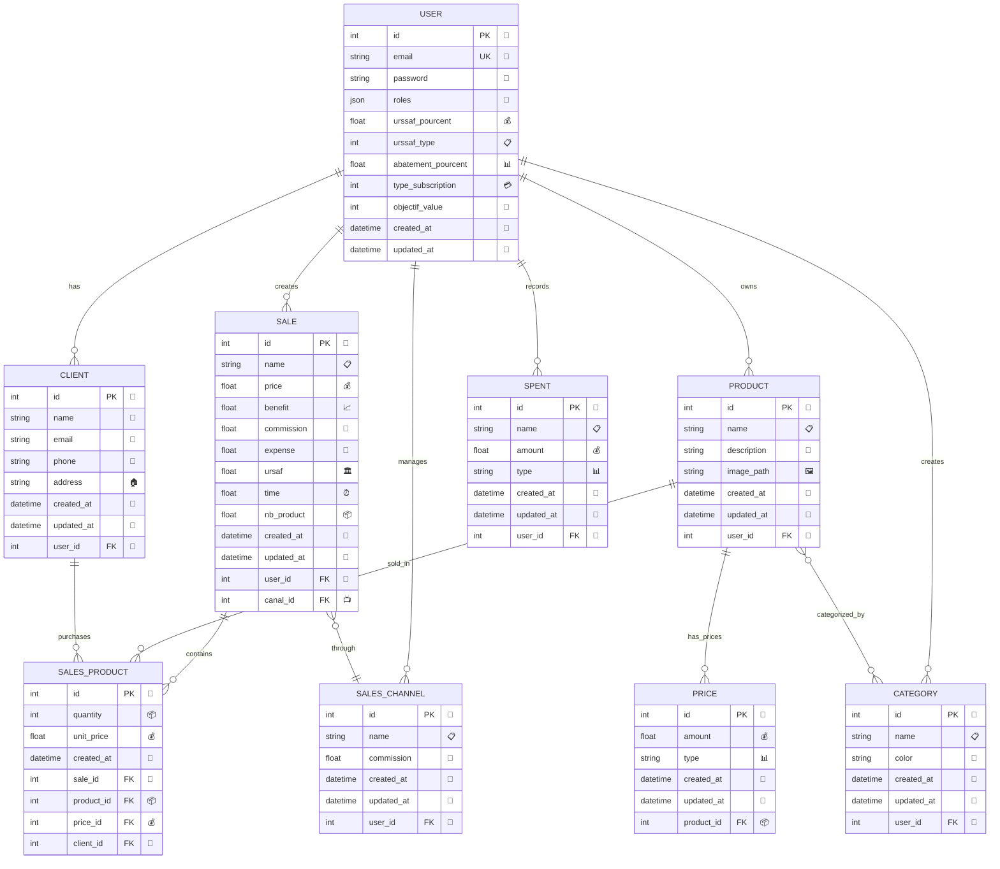
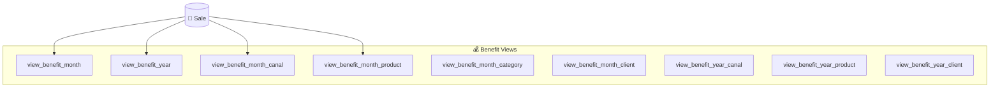
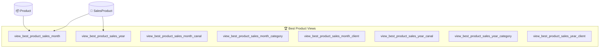
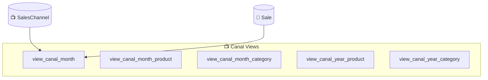
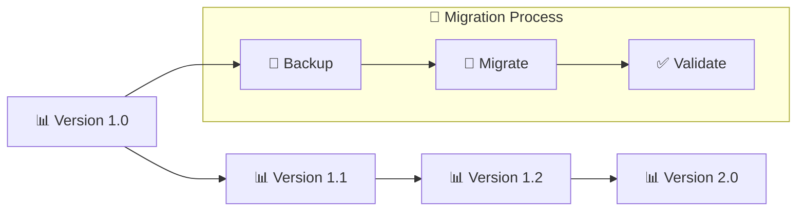

# 📊 Schéma de Base de Données - Maker Copilot

## 🗄️ Vue d'Ensemble

La base de données de Maker Copilot est conçue pour **gérer efficacement** les données d'activité des créateurs, avec un focus sur la **performance des rapports** et l'**évolutivité**.

## 🏗️ Architecture de Données



## 📋 Tables Principales

### 👤 **User** - Utilisateurs
Table centrale contenant les créateurs/entrepreneurs.

| Champ | Type | Description | Contraintes |
|-------|------|-------------|-------------|
| `id` | INT | Identifiant unique | PK, AUTO_INCREMENT |
| `email` | VARCHAR(180) | Email de connexion | UNIQUE, NOT NULL |
| `password` | VARCHAR(255) | Mot de passe hashé | NOT NULL |
| `roles` | JSON | Rôles utilisateur | DEFAULT ['ROLE_USER'] |
| `urssaf_pourcent` | FLOAT | Taux URSSAF | NULLABLE |
| `urssaf_type` | INT | Type de régime URSSAF | NULLABLE |
| `abatement_pourcent` | FLOAT | Taux d'abattement | DEFAULT 0 |
| `type_subscription` | INT | Type d'abonnement | DEFAULT 0 |
| `objectif_value` | INT | Objectif de CA mensuel | NULLABLE |
| `created_at` | DATETIME | Date de création | NOT NULL |
| `updated_at` | DATETIME | Date de modification | NOT NULL |

**🎭 Types d'Abonnement :**
- `0` : Gratuit
- `1` : Basic (5€/mois)
- `2` : Full (10€/mois)
- `3` : Basic Testeur (3.5€/mois)
- `4` : Full Testeur (6.5€/mois)
- `5` : Full Gratuit

### 🛒 **Sale** - Ventes
Enregistrement des transactions de vente.

| Champ | Type | Description | Contraintes |
|-------|------|-------------|-------------|
| `id` | INT | Identifiant unique | PK, AUTO_INCREMENT |
| `name` | VARCHAR(255) | Nom de la vente | NOT NULL |
| `price` | FLOAT | Prix total HT | NOT NULL |
| `benefit` | FLOAT | Bénéfice calculé | NOT NULL |
| `commission` | FLOAT | Commission plateforme | NOT NULL |
| `expense` | FLOAT | Frais associés | NOT NULL |
| `ursaf` | FLOAT | Charges URSSAF | NOT NULL |
| `time` | FLOAT | Temps de production (h) | NOT NULL |
| `nb_product` | FLOAT | Nombre de produits | NULLABLE |
| `created_at` | DATETIME | Date de vente | NOT NULL |
| `updated_at` | DATETIME | Date de modification | NOT NULL |
| `user_id` | INT | Propriétaire | FK → User |
| `canal_id` | INT | Canal de vente | FK → SalesChannel |

### 📦 **Product** - Produits
Catalogue des produits/services proposés.

| Champ | Type | Description | Contraintes |
|-------|------|-------------|-------------|
| `id` | INT | Identifiant unique | PK, AUTO_INCREMENT |
| `name` | VARCHAR(255) | Nom du produit | NOT NULL |
| `description` | TEXT | Description détaillée | NULLABLE |
| `image_path` | VARCHAR(255) | Chemin vers l'image | NULLABLE |
| `created_at` | DATETIME | Date de création | NOT NULL |
| `updated_at` | DATETIME | Date de modification | NOT NULL |
| `user_id` | INT | Propriétaire | FK → User |

### 📺 **SalesChannel** - Canaux de Vente
Plateformes et canaux de distribution.

| Champ | Type | Description | Contraintes |
|-------|------|-------------|-------------|
| `id` | INT | Identifiant unique | PK, AUTO_INCREMENT |
| `name` | VARCHAR(255) | Nom du canal | NOT NULL |
| `commission` | FLOAT | Taux de commission (%) | NOT NULL |
| `created_at` | DATETIME | Date de création | NOT NULL |
| `updated_at` | DATETIME | Date de modification | NOT NULL |
| `user_id` | INT | Propriétaire | FK → User |

**📺 Exemples de Canaux :**
- Etsy (commission ~5%)
- Vinted (commission ~5%)
- Instagram (commission 0%)
- Site web personnel (commission 0%)
- Marchés locaux (commission variable)

### 👥 **Client** - Clients
Base de données des clients.

| Champ | Type | Description | Contraintes |
|-------|------|-------------|-------------|
| `id` | INT | Identifiant unique | PK, AUTO_INCREMENT |
| `name` | VARCHAR(255) | Nom complet | NOT NULL |
| `email` | VARCHAR(255) | Email client | NULLABLE |
| `phone` | VARCHAR(50) | Téléphone | NULLABLE |
| `address` | TEXT | Adresse complète | NULLABLE |
| `created_at` | DATETIME | Date de création | NOT NULL |
| `updated_at` | DATETIME | Date de modification | NOT NULL |
| `user_id` | INT | Propriétaire | FK → User |

## 📊 Vues SQL pour Analytics

Le système utilise **21 vues SQL optimisées** pour les rapports et analytics :

### 💰 **Vues de Bénéfices**



**Exemple de Vue :**
```sql
CREATE VIEW view_benefit_month AS
SELECT 
    YEAR(s.created_at) as year,
    MONTH(s.created_at) as month,
    s.user_id,
    SUM(s.benefit) as total_benefit,
    SUM(s.price) as total_sales,
    COUNT(*) as nb_sales
FROM sale s
GROUP BY YEAR(s.created_at), MONTH(s.created_at), s.user_id;
```

### 🏆 **Vues de Performance Produits**



### 📺 **Vues de Canaux**



## 🔍 Index et Optimisations

### 📊 **Index Principales**

```sql
-- Index sur User
CREATE UNIQUE INDEX idx_user_email ON user(email);
CREATE INDEX idx_user_subscription ON user(type_subscription);

-- Index sur Sale (optimisation des rapports)
CREATE INDEX idx_sale_user_date ON sale(user_id, created_at);
CREATE INDEX idx_sale_canal ON sale(canal_id);
CREATE INDEX idx_sale_date ON sale(created_at);

-- Index sur SalesProduct
CREATE INDEX idx_sales_product_sale ON sales_product(sale_id);
CREATE INDEX idx_sales_product_product ON sales_product(product_id);

-- Index sur Product
CREATE INDEX idx_product_user ON product(user_id);
```

### ⚡ **Optimisations de Performance**

1. **🚀 Vues Matérialisées** : Les vues peuvent être matérialisées pour de meilleures performances
2. **📊 Partitioning** : Possible partitioning par user_id pour les grosses volumétries
3. **💾 Cache Query** : Cache des requêtes fréquentes
4. **🔄 Denormalization** : Certains calculs pré-calculés dans les vues

## 🔒 Sécurité des Données

### 🛡️ **Contraintes de Sécurité**

```sql
-- Contraintes de validation
ALTER TABLE user ADD CONSTRAINT chk_user_subscription 
    CHECK (type_subscription BETWEEN 0 AND 5);

ALTER TABLE sale ADD CONSTRAINT chk_sale_positive_amounts
    CHECK (price >= 0 AND benefit >= 0);

-- Triggers pour audit
CREATE TRIGGER tr_user_updated 
BEFORE UPDATE ON user 
FOR EACH ROW SET NEW.updated_at = NOW();
```

### 🔐 **Isolation des Données**

Chaque utilisateur ne peut accéder qu'à **ses propres données** grâce à :

1. **🔍 Row Level Security** via Doctrine Extensions
2. **👤 User Context** automatiquement injecté
3. **🛡️ API Platform Security** configurée par utilisateur

```php
// Extension Doctrine automatique
class CurrentUserExtension implements QueryCollectionExtensionInterface
{
    public function applyToCollection(QueryBuilder $queryBuilder, ...)
    {
        $queryBuilder->andWhere('o.user = :current_user')
                    ->setParameter('current_user', $this->security->getUser());
    }
}
```

## 📈 Évolution et Migration

### 🔄 **Versioning du Schéma**



### 🚀 **Évolutions Prévues**

1. **📊 Time Series Data** : Pour un historique plus fin
2. **🔄 Event Sourcing** : Pour traçabilité complète
3. **📱 Multi-tenant** : Isolation renforcée
4. **☁️ Sharding** : Pour scalabilité horizontale

## 📊 Métriques et Volumétrie

### 📈 **Estimations de Croissance**

| Table | Croissance/Mois | Volumétrie/An | Index Size |
|-------|-----------------|---------------|------------|
| 👤 **User** | +100 | 1,200 | < 1MB |
| 🛒 **Sale** | +10,000 | 120,000 | ~50MB |
| 📦 **Product** | +1,000 | 12,000 | ~5MB |
| 📺 **SalesChannel** | +200 | 2,400 | < 1MB |
| 👥 **Client** | +2,000 | 24,000 | ~10MB |

### 🔧 **Maintenance Recommandée**

```sql
-- Nettoyage périodique (mensuel)
DELETE FROM refresh_tokens WHERE valid UNTIL < NOW() - INTERVAL 30 DAY;

-- Analyse des performances (hebdomadaire)
ANALYZE TABLE sale, sales_product, product;

-- Optimisation des index (trimestriel)
OPTIMIZE TABLE sale, sales_product;
```

---

> 💡 **Conseil** : Cette structure de données est optimisée pour les **rapports fréquents** et la **scalabilité**. Les vues pré-calculées permettent des temps de réponse < 100ms même avec de gros volumes.