# 🏷️ Entités Principales - Maker Copilot

## 📋 Vue d'Ensemble

Les entités de Maker Copilot représentent le **domaine métier** de la gestion d'activité des créateurs. Chaque entité est conçue pour être **autonome** et **cohérente**.

## 👤 User - Utilisateur Principal

L'entité centrale représentant les créateurs/entrepreneurs.

```php
#[ORM\Entity(repositoryClass: UserRepository::class)]
#[ApiResource(
    normalizationContext: ['groups' => ['user:read']],
    denormalizationContext: ['groups' => ['user:write']]
)]
class User implements UserInterface, PasswordAuthenticatedUserInterface
```

### 🔧 **Propriétés Principales**

| Propriété | Type | Description | Validation |
|-----------|------|-------------|------------|
| `id` | int | Identifiant unique | PK Auto-increment |
| `email` | string | Email de connexion | Unique, Email valide |
| `password` | string | Mot de passe hashé | Hashé automatiquement |
| `roles` | array | Rôles utilisateur | JSON, default ['ROLE_USER'] |
| `urssafPourcent` | float | Taux URSSAF (%) | Nullable, >= 0 |
| `urssafType` | int | Type de régime URSSAF | 0-2 |
| `abatementPourcent` | float | Taux d'abattement (%) | Default 0, 0-100 |
| `typeSubscription` | int | Type d'abonnement | 0-5 |
| `objectifValue` | int | Objectif CA mensuel (€) | Nullable, >= 0 |

### 💳 **Types d'Abonnement**

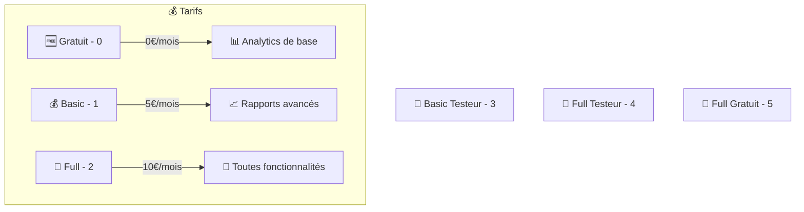

### 🔗 **Relations**

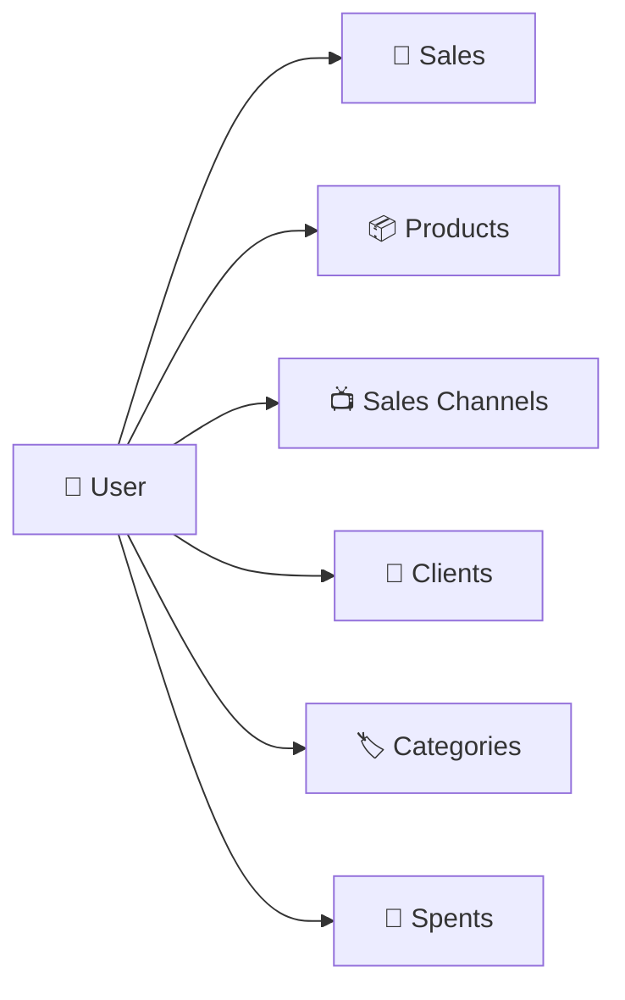

## 🛒 Sale - Vente

Représente une transaction de vente complète.

```php
#[ORM\Entity(repositoryClass: SaleRepository::class)]
#[ApiResource(
    normalizationContext: ['groups' => ['sale:read']],
    denormalizationContext: ['groups' => ['sale:write']],
    order: ['createdAt' => 'DESC']
)]
class Sale
```

### 💰 **Calculs Financiers**

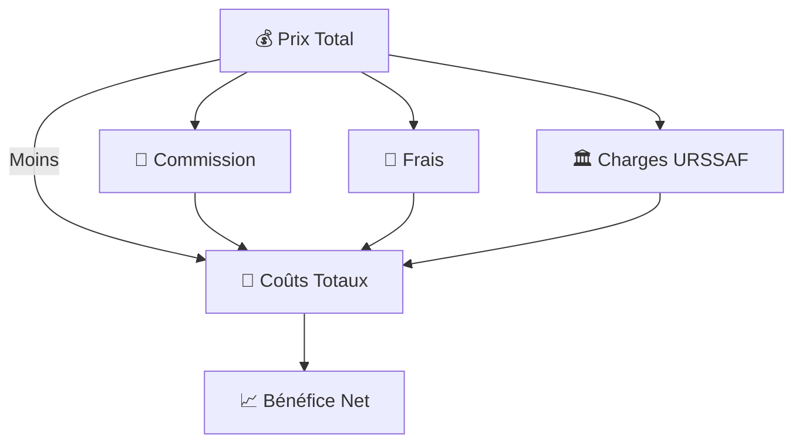

### 📊 **Propriétés Financières**

| Propriété | Type | Description | Calcul |
|-----------|------|-------------|--------|
| `price` | float | Prix total HT | Saisi par l'utilisateur |
| `benefit` | float | Bénéfice net | `price - commission - expense - ursaf` |
| `commission` | float | Commission plateforme | `price * canal.commission / 100` |
| `expense` | float | Frais directs | Saisi par l'utilisateur |
| `ursaf` | float | Charges URSSAF | `price * user.urssafPourcent / 100` |
| `time` | float | Temps de production (h) | Saisi par l'utilisateur |

### 🔄 **Cycle de Vie**

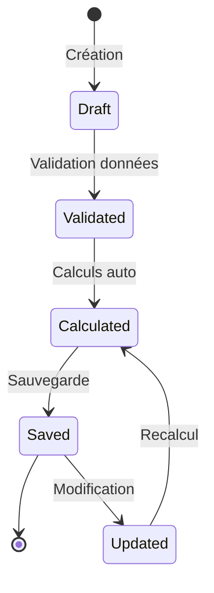

## 📦 Product - Produit

Représente un produit ou service proposé.

```php
#[ORM\Entity(repositoryClass: ProductRepository::class)]
#[ApiResource(
    normalizationContext: ['groups' => ['product:read']],
    denormalizationContext: ['groups' => ['product:write']]
)]
class Product
```

### 🖼️ **Gestion des Images**

```php
#[Vich\UploadableField(mapping: 'product_image', fileNameProperty: 'imagePath')]
private ?File $imageFile = null;
```

**Workflow Upload :**

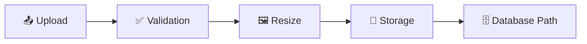

### 💰 **Gestion des Prix**

Un produit peut avoir **plusieurs prix** selon le contexte :

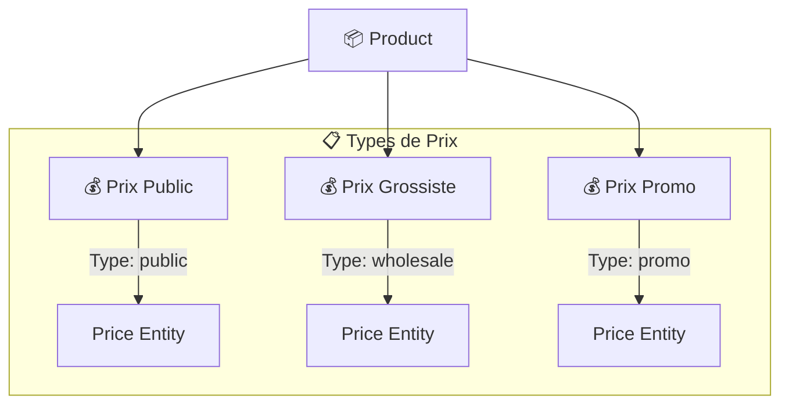

## 📺 SalesChannel - Canal de Vente

Représente les plateformes et canaux de distribution.

```php
#[ORM\Entity(repositoryClass: SalesChannelRepository::class)]
#[ApiResource()]
class SalesChannel
```

### 🏪 **Types de Canaux Typiques**

| Canal | Commission Moyenne | Caractéristiques |
|-------|-------------------|------------------|
| 🛍️ **Etsy** | 5-6% | Marketplace créatif |
| 👗 **Vinted** | 5% | Mode seconde main |
| 📱 **Instagram** | 0% | Réseau social |
| 🌐 **Site Web** | 0% | Site personnel |
| 🏪 **Marché Local** | Variable | Événements physiques |
| 📦 **Amazon Handmade** | 15% | Marketplace Amazon |

### 📊 **Métriques par Canal**

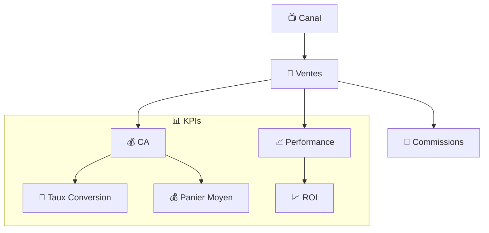

## 👥 Client - Client

Gestion de la base clients.

```php
#[ORM\Entity(repositoryClass: ClientRepository::class)]
#[ApiResource()]
class Client
```

### 📋 **Informations Client**

| Champ | Type | Utilisation |
|-------|------|-------------|
| `name` | string | Identification |
| `email` | string | Communication |
| `phone` | string | Contact direct |
| `address` | text | Livraison |

### 📊 **Analyse Client**

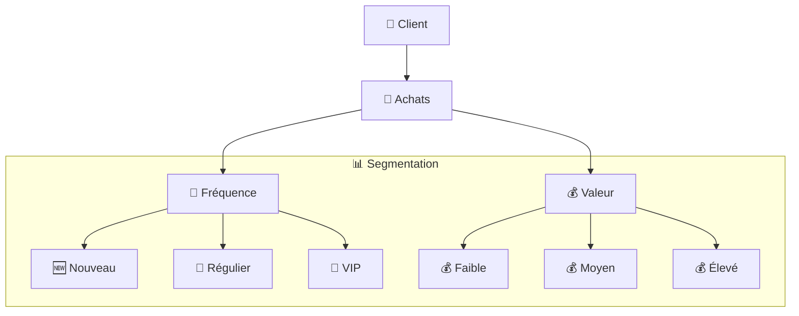

## 🏷️ Category - Catégorie

Organisation des produits par catégories.

```php
#[ORM\Entity(repositoryClass: CategoryRepository::class)]
#[ApiResource()]
class Category
```

### 🎨 **Personnalisation Visuelle**

```php
private ?string $color = null; // Code couleur hexadécimal
```

**Utilisation des couleurs :**
- 📊 **Graphiques** : Distinction visuelle dans les rapports
- 🎨 **Interface** : Cohérence visuelle
- 📈 **Analytics** : Identification rapide

### 📊 **Relations Produit-Catégorie**

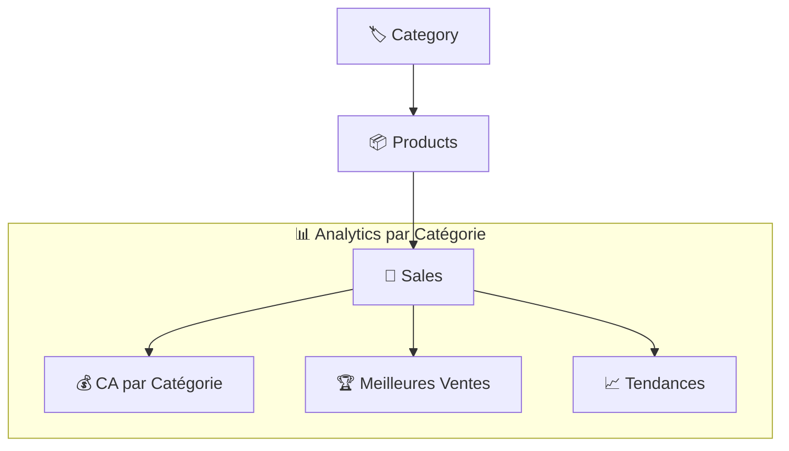

## 💸 Spent - Dépense

Suivi des dépenses professionnelles.

```php
#[ORM\Entity(repositoryClass: SpentRepository::class)]
#[ApiResource()]
class Spent
```

### 📊 **Types de Dépenses**

| Type | Description | Exemples |
|------|-------------|----------|
| 🛒 **Matières Premières** | Achats pour production | Tissus, fils, perles |
| 📦 **Emballage** | Packaging et expédition | Boîtes, papier bulle |
| 🚚 **Transport** | Frais de livraison | Colissimo, chronopost |
| 📱 **Marketing** | Publicité et promotion | Facebook Ads, flyers |
| 🏢 **Administratif** | Frais de gestion | Comptable, assurance |
| 🔧 **Équipement** | Outils et machines | Machine à coudre, PC |

### 💰 **Impact sur la Rentabilité**

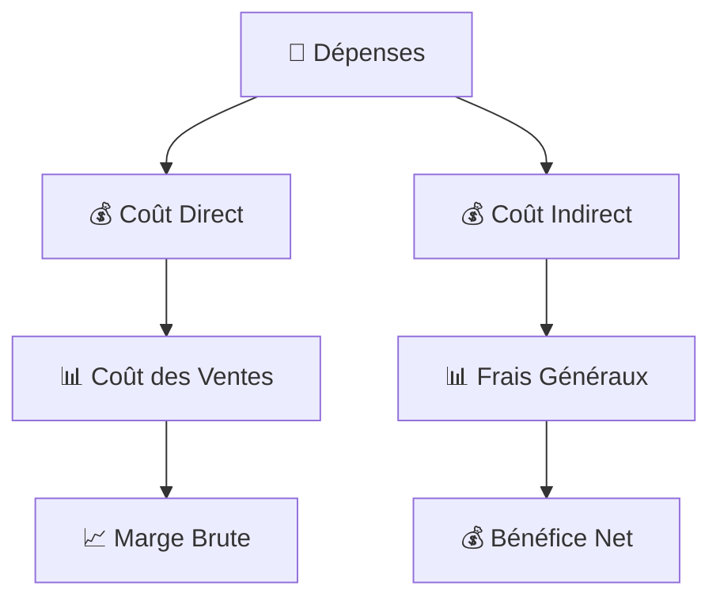

## 🔗 SalesProduct - Ligne de Vente

Table de liaison entre ventes et produits.

```php
#[ORM\Entity(repositoryClass: SalesProductRepository::class)]
class SalesProduct
```

### 📦 **Détail de la Ligne**

| Propriété | Type | Description |
|-----------|------|-------------|
| `quantity` | int | Quantité vendue |
| `unitPrice` | float | Prix unitaire |
| `sale` | Sale | Vente associée |
| `product` | Product | Produit vendu |
| `price` | Price | Prix appliqué |
| `client` | Client | Client acheteur |

### 📊 **Calculs Automatiques**

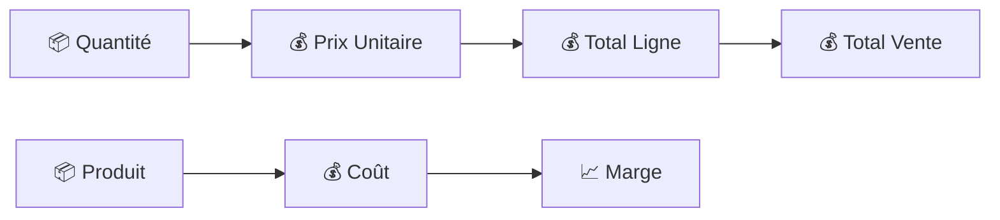

## 💰 Price - Prix

Gestion des différents prix par produit.

```php
#[ORM\Entity(repositoryClass: PriceRepository::class)]
#[ApiResource()]
class Price
```

### 📊 **Types de Prix**

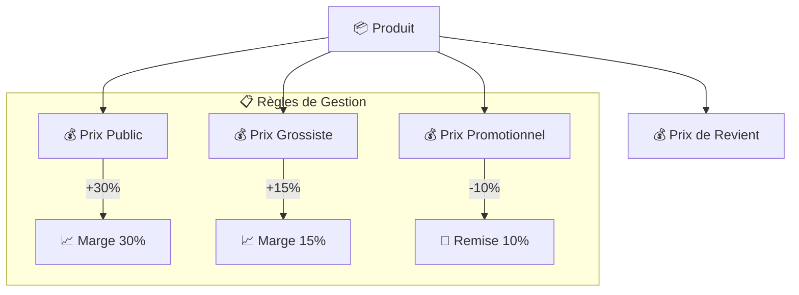

## 💳 Stripe - Entités d'Abonnement

### 📦 Plan - Plans d'Abonnement

Représente les différents plans d'abonnement disponibles.

```php
#[ORM\Entity(repositoryClass: PlanRepository::class)]
#[ApiResource(
    normalizationContext: ['groups' => ['plan:read']],
    security: "is_granted('ROLE_USER')"
)]
class Plan
```

#### 💰 **Structure des Plans**

| Propriété | Type | Description | Exemples |
|-----------|------|-------------|----------|
| `id` | int | Identifiant unique | PK Auto-increment |
| `slug` | string | Identifiant textuel | starter, pro, unlimited |
| `name` | string | Nom affiché | Plan Starter, Plan Pro |
| `priceMonthly` | float | Prix mensuel (€) | 0.00, 5.00, 10.00 |
| `priceYearly` | float | Prix annuel (€) | 0.00, 55.00, 100.00 |
| `maxProducts` | int | Limite produits | 3, 50, null (illimité) |
| `hasDetailedReports` | bool | Rapports détaillés | false, true, true |
| `stripeMonthlyPriceId` | string | ID prix Stripe mensuel | price_monthly_... |
| `stripeYearlyPriceId` | string | ID prix Stripe annuel | price_yearly_... |

#### 🎯 **Plans Disponibles**

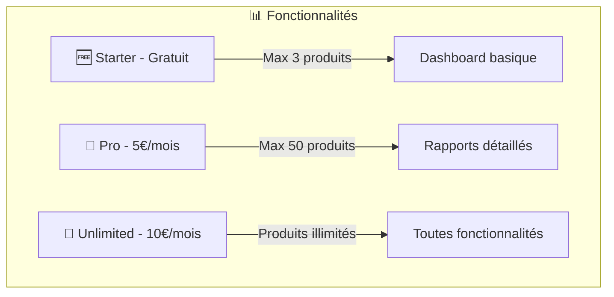

### 📄 Subscription - Abonnement Utilisateur

Gère les abonnements actifs des utilisateurs.

```php
#[ORM\Entity(repositoryClass: SubscriptionRepository::class)]
#[ApiResource(
    normalizationContext: ['groups' => ['subscription:read']],
    security: "is_granted('ROLE_USER') and object.user == user"
)]
class Subscription
```

#### 🔄 **Cycle de Vie de l'Abonnement**

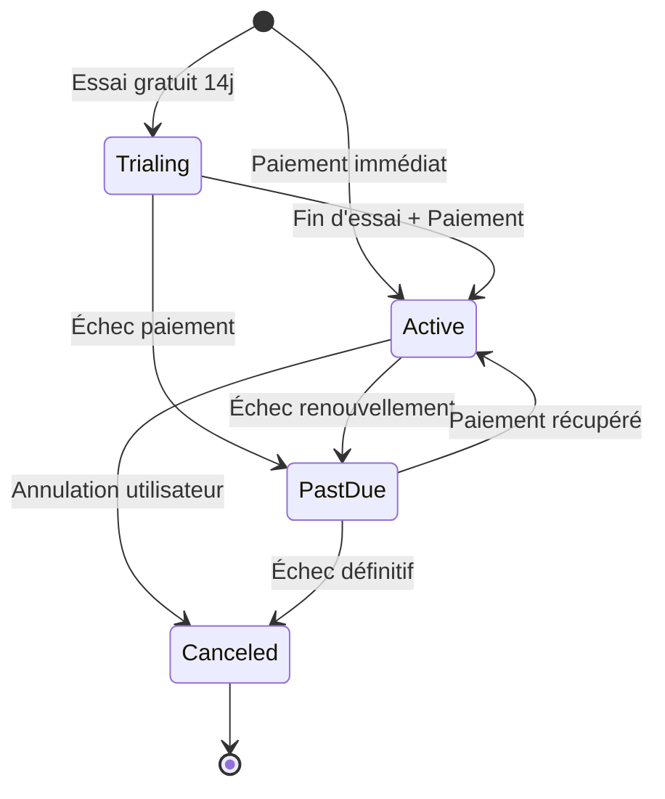

#### 💳 **Propriétés Principales**

| Propriété | Type | Description | États |
|-----------|------|-------------|-------|
| `stripeSubscriptionId` | string | ID abonnement Stripe | sub_... |
| `status` | string | Statut abonnement | active, canceled, past_due, trialing |
| `currentPeriodStart` | DateTime | Début période actuelle | Date facturation |
| `currentPeriodEnd` | DateTime | Fin période actuelle | Prochaine facturation |
| `billingInterval` | string | Intervalle facturation | month, year |
| `trialStart` | DateTime | Début essai gratuit | Nullable |
| `trialEnd` | DateTime | Fin essai gratuit | Nullable |
| `canceledAt` | DateTime | Date d'annulation | Nullable |

### 📃 Invoice - Facture

Synchronisation avec les factures Stripe.

```php
#[ORM\Entity(repositoryClass: InvoiceRepository::class)]
#[ApiResource(
    normalizationContext: ['groups' => ['invoice:read']],
    security: "is_granted('ROLE_USER') and object.subscription.user == user"
)]
class Invoice
```

#### 💰 **Gestion des Factures**

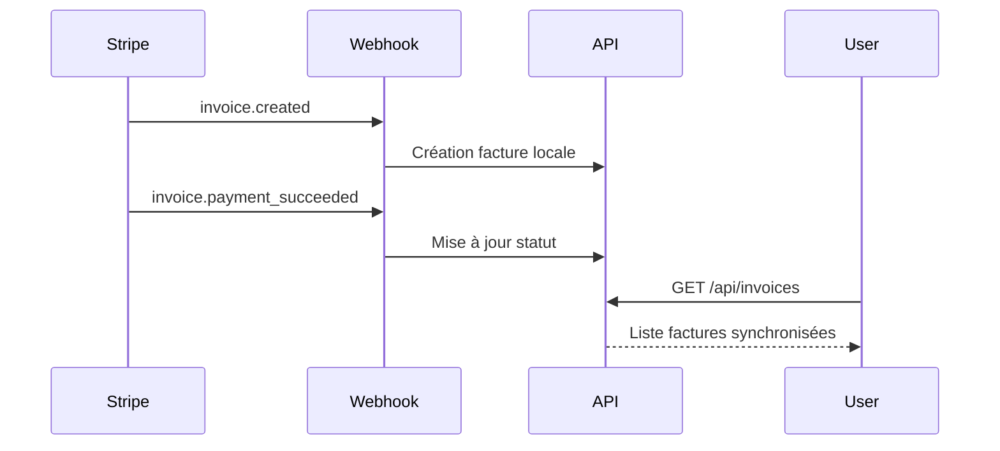

#### 📊 **Structure Facture**

| Propriété | Type | Description | Utilisation |
|-----------|------|-------------|-------------|
| `stripeInvoiceId` | string | ID facture Stripe | inv_... |
| `invoiceNumber` | string | Numéro facture | 1234-5678 |
| `status` | string | Statut facture | paid, open, void |
| `total` | float | Montant total | En centimes (500 = 5€) |
| `amountPaid` | float | Montant payé | En centimes |
| `currency` | string | Devise | EUR, USD |
| `dueDate` | DateTime | Date d'échéance | Date limite paiement |
| `paidAt` | DateTime | Date de paiement | Nullable |
| `hostedInvoiceUrl` | string | URL facture hébergée | Stripe hosted invoice |
| `invoicePdf` | string | URL PDF facture | Téléchargement direct |

### 💳 PaymentMethod - Moyen de Paiement

Gestion sécurisée des moyens de paiement.

```php
#[ORM\Entity(repositoryClass: PaymentMethodRepository::class)]
#[ApiResource(
    normalizationContext: ['groups' => ['payment_method:read']],
    security: "is_granted('ROLE_USER') and object.user == user"
)]
class PaymentMethod
```

#### 🔒 **Sécurité des Données**

```mermaid
graph TD
    User[👤 Utilisateur] --> Stripe[💳 Stripe]
    Stripe --> Local[🗄️ Base Locale]
    
    subgraph "🔒 Données Stockées Localement"
        Local --> Brand[🏷️ Marque carte]
        Local --> Last4[🔢 4 derniers chiffres]
        Local --> ExpMonth[📅 Mois expiration]
        Local --> ExpYear[📅 Année expiration]
        Local --> Type[💳 Type (card/sepa...)]
    end
    
    subgraph "❌ JAMAIS Stocké Localement"
        NoStore[🚫 Numéro complet carte]
        NoStore2[🚫 Code CVC]
        NoStore3[🚫 Données sensibles]
    end
```

#### 💳 **Propriétés PaymentMethod**

| Propriété | Type | Description | Sécurité |
|-----------|------|-------------|----------|
| `stripePaymentMethodId` | string | ID Stripe | pm_... |
| `type` | string | Type moyen | card, sepa_debit |
| `cardBrand` | string | Marque carte | visa, mastercard |
| `cardLast4` | string | 4 derniers chiffres | 4242 |
| `cardExpMonth` | int | Mois expiration | 12 |
| `cardExpYear` | int | Année expiration | 2025 |
| `isDefault` | bool | Moyen par défaut | true/false |

### 🏛️ StripeCustomer - Client Stripe

Liaison entre utilisateur local et customer Stripe.

```php
#[ORM\Entity(repositoryClass: StripeCustomerRepository::class)]
class StripeCustomer
```

#### 🔗 **Synchronisation User-Customer**

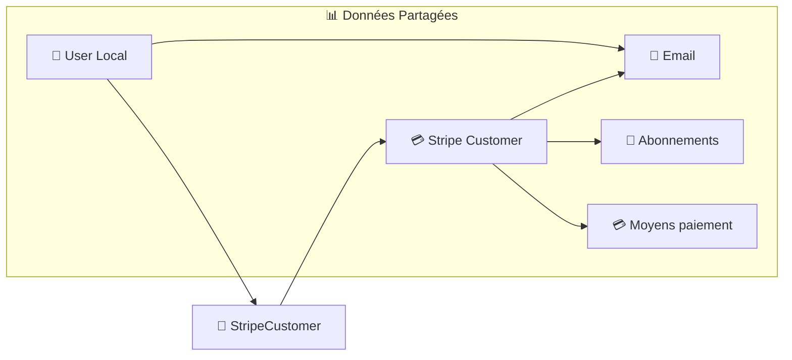

## 🔄 Hooks et Événements

### ⚡ **Lifecycle Callbacks**

```php
#[ORM\PrePersist]
#[ORM\PreUpdate]
public function setUpdatedAtValue(): void
{
    $this->updatedAt = new \DateTimeImmutable();
}
```

### 🎯 **Event Listeners**

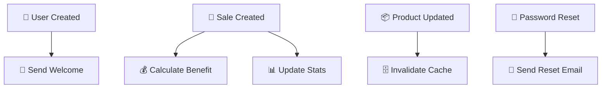

## 🛡️ Sécurité des Entités

### 🔒 **Validation Automatique**

```php
#[Assert\NotBlank]
#[Assert\Email]
private ?string $email = null;

#[Assert\Range(min: 0, max: 100)]
private ?float $urssafPourcent = null;
```

### 👤 **Isolation des Données**

```php
// Extension Doctrine automatique pour filtrer par utilisateur
class CurrentUserExtension implements QueryCollectionExtensionInterface
{
    public function applyToCollection(QueryBuilder $queryBuilder, ...)
    {
        if ($resourceClass === User::class) {
            return; // Skip for User entity
        }
        
        $queryBuilder->andWhere('o.user = :current_user')
                    ->setParameter('current_user', $this->security->getUser());
    }
}
```

## 📊 Métriques des Entités

### 📋 **Entités Principales**

| Entité | Nb Propriétés | Relations | Complexité | Validation |
|--------|---------------|-----------|------------|------------|
| 👤 **User** | 12 | 7 OneToMany | Élevée | ✅ Forte |
| 🛒 **Sale** | 11 | 3 Relations | Moyenne | ✅ Moyenne |
| 📦 **Product** | 6 | 4 Relations | Faible | ✅ Faible |
| 📺 **SalesChannel** | 5 | 1 OneToMany | Faible | ✅ Faible |
| 👥 **Client** | 7 | 2 Relations | Faible | ✅ Moyenne |
| 🏷️ **Category** | 5 | 2 Relations | Faible | ✅ Faible |

### 💳 **Entités Stripe**

| Entité | Nb Propriétés | Relations | Complexité | Validation |
|--------|---------------|-----------|------------|------------|
| 📦 **Plan** | 9 | 1 OneToMany | Faible | ✅ Forte |
| 📄 **Subscription** | 10 | 3 Relations | Élevée | ✅ Forte |
| 📃 **Invoice** | 11 | 1 ManyToOne | Moyenne | ✅ Moyenne |
| 💳 **PaymentMethod** | 8 | 1 ManyToOne | Faible | ✅ Moyenne |
| 🏛️ **StripeCustomer** | 3 | 1 OneToOne | Faible | ✅ Faible |

---

> 💡 **Conseil** : Ces entités sont conçues pour être **évolutives** et **maintenables**. Chaque propriété a un rôle précis dans la logique métier de gestion d'activité des créateurs.