# 🖥️ Intégration Frontend - Maker Copilot

> 🎨 **Documentation complète de l'intégration Vue.js 3 avec le backend Symfony**

## 🏗️ Vue d'Ensemble

Le frontend de Maker Copilot est développé en **Vue.js 3** avec **Composition API** et intègre parfaitement le système d'abonnement Stripe via des composants réactifs et modulaires.

## 📋 Stack Frontend

| Technologie | Version | Utilisation |
|-------------|---------|-------------|
| **Vue.js** | 3.4+ | Framework principal |
| **Vue Router** | 4.x | Routing SPA |
| **Axios** | 1.6+ | Client HTTP |
| **Tailwind CSS** | 3.x | Framework CSS |
| **HeadlessUI** | 1.7+ | Composants accessibles |
| **Heroicons** | 2.x | Icônes |
| **Vue Teleport** | Built-in | Gestion modales |

## 🔐 Architecture d'Authentification

### 🎯 **JWT Token Management**

```javascript
// src/api/auth.js
import axios from 'axios';

class AuthService {
  constructor() {
    this.token = localStorage.getItem('token');
    this.refreshToken = localStorage.getItem('refresh_token');
    this.setupAxiosInterceptors();
  }

  setupAxiosInterceptors() {
    // Ajout automatique du token
    axios.interceptors.request.use((config) => {
      if (this.token) {
        config.headers.Authorization = `Bearer ${this.token}`;
      }
      return config;
    });

    // Gestion auto du refresh token
    axios.interceptors.response.use(
      (response) => response,
      async (error) => {
        if (error.response?.status === 401 && this.refreshToken) {
          await this.refreshAccessToken();
          return axios.request(error.config);
        }
        return Promise.reject(error);
      }
    );
  }
}
```

### 🔄 **Login Flow**


## 💳 Système d'Abonnement Frontend

### 📊 **Architecture des Composants**

```mermaid
graph TD
    Settings[⚙️ Settings.vue] --> SubscriptionUser[👤 SubscriptionUser.vue]
    Settings --> PlanSelection[📋 PlanSelection.vue]
    Settings --> InvoicesList[📃 InvoicesList.vue]
    Settings --> PaymentMethods[💳 PaymentMethods.vue]
    
    PlanSelection --> SubscriptionModal[🔔 SubscriptionModal.vue]
    SubscriptionUser --> SubscriptionModal
    
    subgraph "🔧 Services"
        SubscriptionService[📡 SubscriptionService.js]
        ToastService[🍞 Toast Service]
    end
    
    SubscriptionUser --> SubscriptionService
    PlanSelection --> SubscriptionService
    InvoicesList --> SubscriptionService
    PaymentMethods --> SubscriptionService
```



### 🎮 **SubscriptionService.js**

Service principal pour la gestion des abonnements :

```javascript
// src/api/services/SubscriptionService.js
import axios from 'axios';
import { toast } from 'vue3-toastify';

// 🛒 Créer une session de checkout Stripe
export const CreateCheckoutSession = async (planId, billingInterval = 'monthly') => {
  try {
    const response = await axios.post("/subscriptions/create-checkout", {
      planId,
      billingInterval,
      successUrl: window.location.origin + "/dashboard?subscription=success",
      cancelUrl: window.location.origin + "/settings"
    });
    
    if (response.data.checkoutUrl) {
      window.location.href = response.data.checkoutUrl;
    }
    return response.data;
  } catch (error) {
    console.error(error);
    toast.error("Erreur lors de la création de la session de paiement");
    throw error;
  }
};

// 📊 Récupérer l'abonnement actuel avec limites
export const GetCurrentSubscription = async () => {
  try {
    const response = await axios.get("/subscriptions/current");
    return response.data;
  } catch (error) {
    console.error(error);
    toast.error("Erreur lors de la récupération de l'abonnement");
    throw error;
  }
};

// ❌ Annuler l'abonnement
export const CancelSubscription = async (subscriptionId, atPeriodEnd = true) => {
  try {
    const response = await axios.post(`/subscriptions/${subscriptionId}/cancel`, {
      at_period_end: atPeriodEnd
    });
    toast.success("Abonnement annulé avec succès");
    return response.data;
  } catch (error) {
    console.error(error);
    toast.error("Erreur lors de l'annulation de l'abonnement");
    throw error;
  }
};
```

### 🎨 **Composant PlanSelection.vue**

Sélection et comparaison des plans :

```vue
<template>
  <div class="bg-white rounded-xl shadow-lg p-6">
    <!-- Toggle mensuel/annuel -->
    <div class="flex justify-center mb-8">
      <div class="bg-gray-100 p-1 rounded-lg inline-flex">
        <button 
          @click="billingInterval = 'monthly'"
          :class="billingInterval === 'monthly' ? 'bg-white shadow' : ''"
          class="px-4 py-2 rounded-md transition-all"
        >
          Mensuel
        </button>
        <button 
          @click="billingInterval = 'yearly'"
          :class="billingInterval === 'yearly' ? 'bg-white shadow' : ''"
          class="px-4 py-2 rounded-md transition-all"
        >
          <span>Annuel</span>
          <span class="text-green-600 text-sm ml-1">(-17%)</span>
        </button>
      </div>
    </div>

    <!-- Grille des plans -->
    <div class="grid md:grid-cols-3 gap-6">
      <div 
        v-for="plan in plans" 
        :key="plan.id"
        :class="[
          'border-2 rounded-xl p-6 relative transition-all hover:shadow-lg',
          plan.slug === 'pro' ? 'border-blue-500 bg-blue-50' : 'border-gray-200'
        ]"
      >
        <!-- Badge populaire -->
        <div 
          v-if="plan.slug === 'pro'" 
          class="absolute -top-3 left-1/2 transform -translate-x-1/2"
        >
          <span class="bg-blue-500 text-white px-4 py-1 rounded-full text-sm font-medium">
            🚀 Populaire
          </span>
        </div>

        <!-- Contenu du plan -->
        <div class="text-center">
          <h3 class="text-xl font-semibold mb-2">{{ plan.name }}</h3>
          <div class="mb-4">
            <span class="text-3xl font-bold">
              {{ formatPrice(billingInterval === 'yearly' ? plan.priceYearly : plan.priceMonthly) }}
            </span>
            <span class="text-gray-600">/{{ billingInterval === 'yearly' ? 'an' : 'mois' }}</span>
          </div>
          
          <!-- Fonctionnalités -->
          <ul class="space-y-3 mb-6 text-left">
            <li class="flex items-center">
              <CheckIcon class="h-5 w-5 text-green-500 mr-2" />
              <span>{{ plan.maxProducts || '∞' }} produits</span>
            </li>
            <li class="flex items-center">
              <CheckIcon class="h-5 w-5 text-green-500 mr-2" />
              <span>Dashboard</span>
            </li>
            <li class="flex items-center" v-if="plan.hasDetailedReports">
              <CheckIcon class="h-5 w-5 text-green-500 mr-2" />
              <span>Rapports détaillés</span>
            </li>
          </ul>

          <!-- Bouton d'action -->
          <button 
            @click="handlePlanSelection(plan)"
            :disabled="isCurrentPlan(plan) || loading"
            class="w-full py-2 px-4 rounded-lg font-medium transition-colors"
            :class="getButtonClasses(plan)"
          >
            {{ getButtonText(plan) }}
          </button>
        </div>
      </div>
    </div>
  </div>
</template>

<script setup>
import { ref, onMounted } from 'vue';
import { CheckIcon } from '@heroicons/vue/20/solid';
import { CreateCheckoutSession, GetPlans } from '@/api/services/SubscriptionService';

const billingInterval = ref('monthly');
const plans = ref([]);
const loading = ref(false);
const currentUserPlan = ref(null);

const handlePlanSelection = async (plan) => {
  if (plan.slug === 'starter') return; // Plan gratuit
  
  loading.value = true;
  try {
    await CreateCheckoutSession(plan.id, billingInterval.value);
  } finally {
    loading.value = false;
  }
};
</script>
```

### 📃 **Composant InvoicesList.vue**

Gestion des factures avec pagination :

```vue
<template>
  <div class="bg-white rounded-xl shadow-lg p-6">
    <h2 class="text-xl font-semibold mb-6">📃 Mes Factures</h2>

    <!-- Statistiques -->
    <div class="grid grid-cols-1 md:grid-cols-3 gap-4 mb-6">
      <div class="bg-blue-50 p-4 rounded-lg">
        <div class="text-2xl font-bold text-blue-600">{{ invoiceStats.total }}</div>
        <div class="text-blue-600">Total factures</div>
      </div>
      <div class="bg-green-50 p-4 rounded-lg">
        <div class="text-2xl font-bold text-green-600">{{ invoiceStats.paid }}</div>
        <div class="text-green-600">Payées</div>
      </div>
      <div class="bg-orange-50 p-4 rounded-lg">
        <div class="text-2xl font-bold text-orange-600">
          {{ formatPrice(invoiceStats.totalAmount) }}
        </div>
        <div class="text-orange-600">Montant total</div>
      </div>
    </div>

    <!-- Liste des factures -->
    <div class="overflow-x-auto">
      <table class="w-full">
        <thead class="bg-gray-50">
          <tr>
            <th class="px-4 py-3 text-left font-medium text-gray-900">Facture</th>
            <th class="px-4 py-3 text-left font-medium text-gray-900">Date</th>
            <th class="px-4 py-3 text-left font-medium text-gray-900">Montant</th>
            <th class="px-4 py-3 text-left font-medium text-gray-900">Statut</th>
            <th class="px-4 py-3 text-left font-medium text-gray-900">Actions</th>
          </tr>
        </thead>
        <tbody class="divide-y divide-gray-200">
          <tr v-for="invoice in invoices" :key="invoice.id">
            <td class="px-4 py-4">
              <div class="font-medium">{{ invoice.invoiceNumber }}</div>
            </td>
            <td class="px-4 py-4">
              {{ formatDate(invoice.paidAt || invoice.dueDate) }}
            </td>
            <td class="px-4 py-4">
              {{ formatPrice(invoice.total) }}
            </td>
            <td class="px-4 py-4">
              <span :class="getStatusClass(invoice.status)" class="px-2 py-1 rounded-full text-xs font-medium">
                {{ getStatusText(invoice.status) }}
              </span>
            </td>
            <td class="px-4 py-4">
              <button 
                @click="downloadInvoice(invoice)"
                class="text-blue-600 hover:text-blue-800 font-medium"
              >
                📄 Télécharger
              </button>
            </td>
          </tr>
        </tbody>
      </table>
    </div>

    <!-- Pagination -->
    <div v-if="pagination.pages > 1" class="flex justify-center mt-6">
      <nav class="flex space-x-2">
        <button 
          v-for="page in pagination.pages" 
          :key="page"
          @click="currentPage = page"
          :class="page === currentPage ? 'bg-blue-600 text-white' : 'bg-gray-200 text-gray-700'"
          class="px-3 py-2 rounded-md hover:bg-blue-500 hover:text-white transition-colors"
        >
          {{ page }}
        </button>
      </nav>
    </div>
  </div>
</template>

<script setup>
import { ref, onMounted, computed } from 'vue';
import { GetInvoices, GetInvoiceStats } from '@/api/services/SubscriptionService';

const invoices = ref([]);
const invoiceStats = ref({});
const currentPage = ref(1);
const pagination = ref({ pages: 1, total: 0 });

const downloadInvoice = (invoice) => {
  if (invoice.invoicePdf) {
    window.open(invoice.invoicePdf, '_blank');
  } else if (invoice.hostedInvoiceUrl) {
    window.open(invoice.hostedInvoiceUrl, '_blank');
  }
};

const loadInvoices = async () => {
  try {
    const response = await GetInvoices(currentPage.value);
    invoices.value = response.invoices;
    pagination.value = response.pagination;
  } catch (error) {
    console.error('Erreur lors du chargement des factures:', error);
  }
};

onMounted(async () => {
  await Promise.all([
    loadInvoices(),
    GetInvoiceStats().then(stats => invoiceStats.value = stats)
  ]);
});
</script>
```

## 🎯 **Gestion des États Réactifs**

### 📊 **Composable useSubscription**

```javascript
// src/composables/useSubscription.js
import { ref, computed } from 'vue';
import { GetCurrentSubscription } from '@/api/services/SubscriptionService';

export function useSubscription() {
  const subscription = ref(null);
  const planLimits = ref(null);
  const loading = ref(false);

  // État calculés
  const isActive = computed(() => 
    subscription.value?.status === 'active'
  );
  
  const isTrialing = computed(() => 
    subscription.value?.status === 'trialing'
  );
  
  const canCreateProducts = computed(() => 
    planLimits.value?.can_create_products ?? true
  );
  
  const productsUsage = computed(() => ({
    current: planLimits.value?.current_products ?? 0,
    max: planLimits.value?.max_products,
    percentage: planLimits.value?.max_products ? 
      Math.round((planLimits.value.current_products / planLimits.value.max_products) * 100) : 0
  }));

  // Méthodes
  const loadSubscription = async () => {
    loading.value = true;
    try {
      const data = await GetCurrentSubscription();
      subscription.value = data.subscription;
      planLimits.value = data.plan_limits;
    } catch (error) {
      console.error('Erreur chargement abonnement:', error);
    } finally {
      loading.value = false;
    }
  };

  return {
    subscription,
    planLimits,
    loading,
    isActive,
    isTrialing,
    canCreateProducts,
    productsUsage,
    loadSubscription
  };
}
```

## 🚀 **Optimisations Performance**

### ⚡ **Lazy Loading des Composants**

```javascript
// src/router/index.js
const routes = [
  {
    path: '/settings',
    name: 'Settings',
    component: () => import('@/views/private/Setting/Settings.vue'),
    children: [
      {
        path: 'subscription',
        name: 'Subscription',
        component: () => import('@/views/private/Setting/components/SubscriptionUser.vue')
      }
    ]
  }
];
```

### 🔄 **Cache des Données**

```javascript
// src/api/cache.js
class CacheService {
  constructor() {
    this.cache = new Map();
    this.ttl = 5 * 60 * 1000; // 5 minutes
  }

  set(key, data) {
    this.cache.set(key, {
      data,
      timestamp: Date.now()
    });
  }

  get(key) {
    const item = this.cache.get(key);
    if (!item) return null;
    
    if (Date.now() - item.timestamp > this.ttl) {
      this.cache.delete(key);
      return null;
    }
    
    return item.data;
  }
}

export const cache = new CacheService();
```

## 🛡️ **Gestion d'Erreurs**

### 🚨 **Error Boundaries**

```javascript
// src/plugins/errorHandler.js
export function setupErrorHandler(app) {
  app.config.errorHandler = (error, instance, info) => {
    console.error('Vue Error:', error);
    console.error('Component:', instance);
    console.error('Info:', info);
    
    // Signaler à un service de monitoring
    if (import.meta.env.PROD) {
      // Sentry.captureException(error);
    }
  };
}
```

### 🔄 **Retry Logic**

```javascript
// src/utils/retry.js
export async function withRetry(fn, maxAttempts = 3, delay = 1000) {
  for (let attempt = 1; attempt <= maxAttempts; attempt++) {
    try {
      return await fn();
    } catch (error) {
      if (attempt === maxAttempts) throw error;
      
      console.warn(`Tentative ${attempt} échouée, retry dans ${delay}ms...`);
      await new Promise(resolve => setTimeout(resolve, delay));
      delay *= 2; // Exponential backoff
    }
  }
}
```

## 📱 **Responsive Design**

### 🎨 **Breakpoints Tailwind**

```javascript
// tailwind.config.js
module.exports = {
  theme: {
    screens: {
      'sm': '640px',   // Mobile landscape
      'md': '768px',   // Tablet
      'lg': '1024px',  // Desktop small
      'xl': '1280px',  // Desktop
      '2xl': '1536px'  // Desktop large
    }
  }
}
```

### 📱 **Composants Adaptatifs**

```vue
<template>
  <!-- Mobile: Stack vertical -->
  <div class="grid grid-cols-1 md:grid-cols-2 lg:grid-cols-3 gap-4">
    <div v-for="plan in plans" :key="plan.id" class="plan-card">
      <!-- Contenu adaptif -->
    </div>
  </div>
</template>
```

## 🔧 **Configuration Environnement**

### ⚙️ **Variables d'Environment**

```bash
# .env.local
VITE_API_URL=http://localhost:8000
VITE_APP_NAME=Maker Copilot
VITE_STRIPE_PUBLISHABLE_KEY=pk_test_...
```

### 🛠️ **Build Configuration**

```javascript
// vite.config.js
export default defineConfig({
  plugins: [vue()],
  server: {
    proxy: {
      '/api': {
        target: 'http://localhost:8000',
        changeOrigin: true
      }
    }
  }
});
```

---

> 💡 **Conseil** : Cette intégration offre une expérience utilisateur fluide avec gestion complète des abonnements, paiements sécurisés via Stripe, et interface responsive adaptée à tous les appareils !