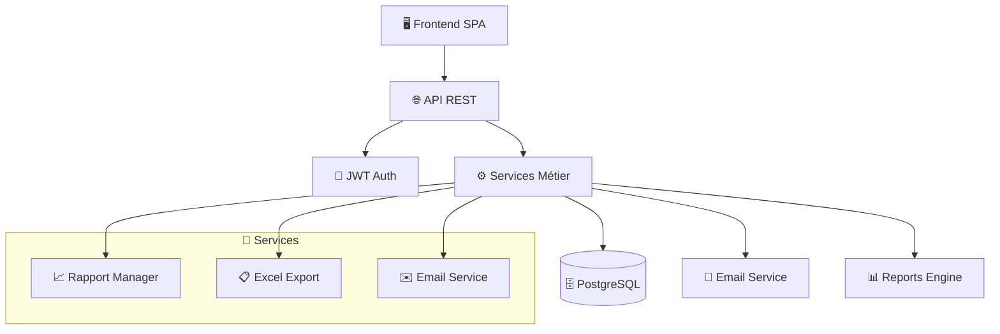

# 🚀 Maker Copilot - Documentation Complète

> 📊 **Plateforme intelligente de gestion d'activité pour créateurs**


## 📑 Table des Matières

### 🏗️ Architecture & Vue d'ensemble
- [🏛️ Architecture Générale](ARCHITECTURE.md)
- [🛠️ Stack Technologique](TECH_STACK.md)
- [⚙️ Configuration](CONFIGURATION.md)

### 🗄️ Base de Données & Modèles
- [📊 Schéma de Base de Données](DATABASE.md)
- [🏷️ Entités Principales](ENTITIES.md)
- [📈 Vues SQL & Analytics](VIEWS.md)

### 🌐 APIs & Contrôleurs
- [📋 Référence API](API_REFERENCE.md)
- [🎮 Contrôleurs](CONTROLLERS.md)
- [🔐 Authentification](AUTHENTICATION.md)

### 💳 Système d'Abonnement
- [💰 Système d'Abonnement](SUBSCRIPTION_SYSTEM.md)
- [🔒 Intégration Stripe](STRIPE_INTEGRATION.md)

### ⚙️ Services & Logique Métier
- [🔧 Services](SERVICES.md)
- [📈 Système de Rapports](REPORTS.md)
- [📧 Système d'Email](EMAIL_SYSTEM.md)

### 🔄 Flux & Processus
- [👤 Flux Utilisateur](USER_FLOWS.md)
- [📊 Flux de Données](DATA_FLOWS.md)
- [💼 Processus Métier](BUSINESS_PROCESSES.md)

### 🚀 Déploiement & Sécurité
- [🚢 Guide de Déploiement](DEPLOYMENT.md)
- [🔒 Sécurité](SECURITY.md)

## 🎯 Qu'est-ce que Maker Copilot ?

Maker Copilot est une **plateforme SaaS** conçue pour aider les créateurs et entrepreneurs à gérer efficacement leur activité. Elle offre :

### ✨ Fonctionnalités Principales

- 📊 **Dashboard Analytics** - Suivi en temps réel des performances
- 💰 **Gestion Financière** - Suivi revenus, dépenses, URSSAF
- 🛍️ **Gestion des Ventes** - Multi-canaux (Etsy, Vinted, Instagram...)
- 📦 **Catalogue Produits** - Gestion complète des produits et prix
- 👥 **Gestion Clients** - Base de données clients intégrée
- 📈 **Rapports Intelligents** - Analytics avancées avec IA
- 🎯 **Objectifs** - Définition et suivi d'objectifs personnalisés
- 💳 **Abonnements Stripe** - Plans Starter/Pro/Unlimited avec paiements sécurisés

### 🏗️ Architecture Technique



### 🎭 Acteurs du Système

- 👤 **Créateurs/Entrepreneurs** - Utilisateurs finaux
- 🏢 **Administrateurs** - Gestion de la plateforme
- 🤖 **Système** - Automatisations et tâches programmées

## 🚀 Démarrage Rapide

### 📋 Prérequis

- PHP 8.1+
- Composer
- PostgreSQL/MySQL
- Node.js (pour le frontend)

### ⚡ Installation

```bash
# 1. Cloner le projet
git clone [repository-url]

# 2. Installer les dépendances
composer install

# 3. Configuration
cp .env.example .env.local
# Configurer la base de données et l'email

# 4. Migrations
php bin/console doctrine:migrations:migrate

# 5. Démarrer le serveur
symfony server:start
```

### 🧪 Tests

```bash
# Tests unitaires
php bin/phpunit

# Test email
php bin/console app:test-email test@example.com

# Validation du code
php bin/console lint:container
```

## 📊 Métriques du Projet

| Composant | Nombre | Description |
|-----------|--------|-------------|
| 🏷️ Entités | 21 | Modèles de données principaux |
| 📊 Vues SQL | 21 | Vues pour analytics et rapports |
| 🎮 Contrôleurs | 15 | Endpoints API REST |
| 🔧 Services | 12 | Services métier |
| 📈 Stratégies | 6 | Stratégies de génération de rapports |

## 🤝 Contribution

1. 🍴 Fork le projet
2. 🌟 Créer une branche feature
3. ✍️ Commiter les changements
4. 📤 Push vers la branche
5. 🔄 Créer une Pull Request

## 📞 Support

- 📧 **Email** : contact@maker-copilot.com
- 📚 **Documentation** : Ce dossier `/docs`
- 🐛 **Issues** : GitHub Issues

## 📄 Licence

Propriétaire - Tous droits réservés

---

> 💡 **Conseil** : Commencez par lire l'[Architecture Générale](ARCHITECTURE.md) pour comprendre la structure du projet !