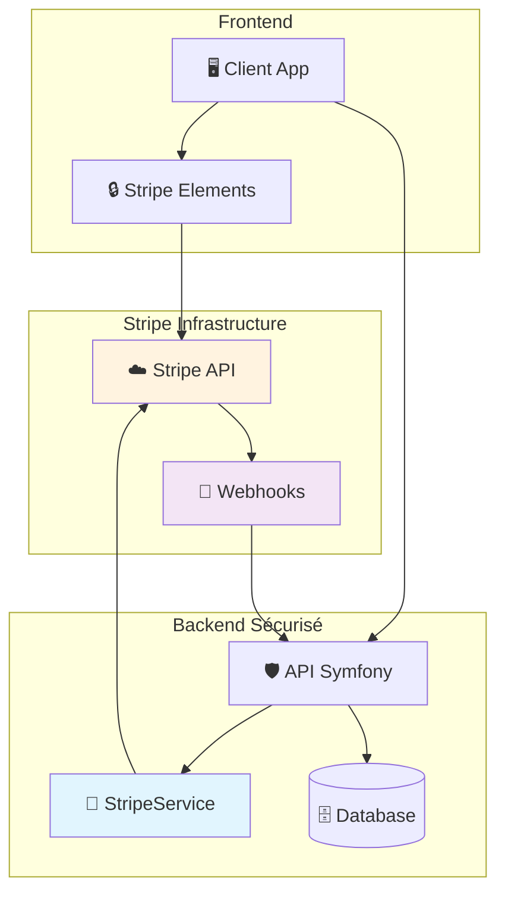

# 🔒 Intégration Stripe Sécurisée

## 🛡️ Sécurité et Conformité

### Standards de Sécurité
- ✅ **PCI-DSS Level 1** - Conformité complète
- ✅ **Chiffrement TLS 1.2+** - Communications sécurisées
- ✅ **Validation Signature** - Webhooks authentifiés
- ✅ **Pas de stockage** - Données cartes chez Stripe uniquement

### Architecture Sécurisée



## 🔐 Configuration Sécurisée

### Variables d'Environnement

```bash
# .env.local - Clés de test pour développement
STRIPE_PUBLISHABLE_KEY=pk_test_YOUR_PUBLISHABLE_KEY_HERE
STRIPE_SECRET_KEY=sk_test_YOUR_SECRET_KEY_HERE
STRIPE_WEBHOOK_SECRET=whsec_your_webhook_secret_here

# .env.prod - Clés de production (JAMAIS en VCS)
STRIPE_PUBLISHABLE_KEY=pk_live_51234567890abcdef...
STRIPE_SECRET_KEY=sk_live_51234567890abcdef...
STRIPE_WEBHOOK_SECRET=whsec_1234567890abcdef...
```

> ⚠️ **Important** : Le fichier `.env.local` est dans `.gitignore` pour protéger vos clés

### Service Configuration

```yaml
# config/services.yaml
parameters:
    stripe_secret_key: '%env(STRIPE_SECRET_KEY)%'
    stripe_webhook_secret: '%env(STRIPE_WEBHOOK_SECRET)%'

services:
    App\Service\StripeService:
        arguments:
            $stripeSecretKey: '%stripe_secret_key%'
            $stripeWebhookSecret: '%stripe_webhook_secret%'
```

## 🔒 Validation des Webhooks

### Signature Stripe

```php
public function validateWebhookSignature(string $payload, string $signature): \Stripe\Event
{
    try {
        return \Stripe\Webhook::constructEvent(
            $payload,
            $signature,
            $this->stripeWebhookSecret
        );
    } catch (\Stripe\Exception\SignatureVerificationException $e) {
        $this->logger->error('Signature webhook invalide', [
            'error' => $e->getMessage()
        ]);
        throw new \RuntimeException('Signature webhook invalide');
    }
}
```

### Contrôleur Webhook Sécurisé

```php
public function handleWebhook(Request $request): Response
{
    $payload = $request->getContent();
    $signature = $request->headers->get('Stripe-Signature');

    if (!$signature) {
        $this->logger->error('Webhook Stripe reçu sans signature');
        return new Response('No signature', Response::HTTP_BAD_REQUEST);
    }

    try {
        $event = $this->stripeService->validateWebhookSignature($payload, $signature);
        
        // Traitement sécurisé de l'événement
        $this->processWebhookEvent($event);
        
        return new Response('OK', Response::HTTP_OK);
    } catch (\Exception $e) {
        $this->logger->error('Erreur webhook', ['error' => $e->getMessage()]);
        return new Response('Error', Response::HTTP_INTERNAL_SERVER_ERROR);
    }
}
```

## 💳 Gestion Sécurisée des Paiements

### Création Session Checkout

```php
public function createCheckoutSession(User $user, Plan $plan, string $billingInterval, string $successUrl, string $cancelUrl): \Stripe\Checkout\Session
{
    try {
        $customer = $this->getOrCreateCustomer($user);
        
        $priceId = $billingInterval === 'year' 
            ? $plan->getStripeYearlyPriceId() 
            : $plan->getStripeMonthlyPriceId();
        
        if (!$priceId) {
            throw new \InvalidArgumentException('Prix Stripe non configuré');
        }

        $sessionData = [
            'customer' => $customer->id,
            'payment_method_types' => ['card'],
            'line_items' => [
                [
                    'price' => $priceId,
                    'quantity' => 1,
                ],
            ],
            'mode' => 'subscription',
            'success_url' => $successUrl,
            'cancel_url' => $cancelUrl,
            'metadata' => [
                'user_id' => $user->getId(),
                'plan_id' => $plan->getId(),
                'billing_interval' => $billingInterval,
            ],
        ];

        // Période d'essai pour nouveaux utilisateurs
        if (!$user->hasActiveSubscription() && !$plan->isFree()) {
            $sessionData['subscription_data']['trial_period_days'] = 14;
        }

        return $this->stripe->checkout->sessions->create($sessionData);

    } catch (ApiErrorException $e) {
        $this->logger->error('Erreur création checkout', [
            'user_id' => $user->getId(),
            'error' => $e->getMessage()
        ]);
        throw new \RuntimeException('Impossible de créer la session: ' . $e->getMessage());
    }
}
```

### Gestion Customer Stripe

```php
public function getOrCreateCustomer(User $user): \Stripe\Customer
{
    try {
        // Vérification customer existant
        if ($user->getStripeCustomerId()) {
            try {
                return $this->stripe->customers->retrieve($user->getStripeCustomerId());
            } catch (ApiErrorException $e) {
                $this->logger->warning('Customer Stripe introuvable', [
                    'user_id' => $user->getId(),
                    'stripe_customer_id' => $user->getStripeCustomerId(),
                ]);
            }
        }

        // Création nouveau customer
        $customer = $this->stripe->customers->create([
            'email' => $user->getEmail(),
            'metadata' => [
                'user_id' => $user->getId(),
            ],
        ]);

        // Sauvegarde sécurisée de l'ID
        $user->setStripeCustomerId($customer->id);
        $this->entityManager->flush();

        return $customer;

    } catch (ApiErrorException $e) {
        throw new \RuntimeException('Impossible de créer le customer: ' . $e->getMessage());
    }
}
```

## 🔐 Gestion des Payment Methods

### Ajout Sécurisé

```php
public function createPaymentMethod(User $user, string $paymentMethodId): PaymentMethod
{
    try {
        $customer = $this->getOrCreateCustomer($user);
        
        // Attacher à Stripe
        $this->stripe->paymentMethods->attach($paymentMethodId, [
            'customer' => $customer->id,
        ]);

        // Récupération sécurisée des détails
        $stripePaymentMethod = $this->stripe->paymentMethods->retrieve($paymentMethodId);

        // Création entité locale (pas de données sensibles)
        $paymentMethod = new PaymentMethod();
        $paymentMethod->setUser($user);
        $paymentMethod->setStripePaymentMethodId($paymentMethodId);
        $paymentMethod->setType($stripePaymentMethod->type);

        // Données carte (non sensibles uniquement)
        if ($stripePaymentMethod->type === 'card') {
            $card = $stripePaymentMethod->card;
            $paymentMethod->setCardLast4($card->last4);
            $paymentMethod->setCardBrand($card->brand);
            $paymentMethod->setCardExpMonth($card->exp_month);
            $paymentMethod->setCardExpYear($card->exp_year);
        }

        $this->entityManager->persist($paymentMethod);
        $this->entityManager->flush();

        return $paymentMethod;

    } catch (ApiErrorException $e) {
        throw new \RuntimeException('Impossible d\'ajouter le moyen de paiement: ' . $e->getMessage());
    }
}
```

### Suppression Sécurisée

```php
public function deletePaymentMethod(PaymentMethod $paymentMethod): void
{
    try {
        // Détacher de Stripe
        $this->stripe->paymentMethods->detach($paymentMethod->getStripePaymentMethodId());

        // Suppression base de données
        $this->entityManager->remove($paymentMethod);
        $this->entityManager->flush();

    } catch (ApiErrorException $e) {
        throw new \RuntimeException('Impossible de supprimer: ' . $e->getMessage());
    }
}
```

## 📊 Synchronisation Sécurisée

### Abonnements

```php
public function syncSubscriptionFromStripe(string $stripeSubscriptionId): Subscription
{
    try {
        $stripeSubscription = $this->stripe->subscriptions->retrieve($stripeSubscriptionId);
        
        $subscription = $this->subscriptionRepository->findByStripeId($stripeSubscriptionId);
        
        if (!$subscription) {
            throw new \RuntimeException('Abonnement non trouvé');
        }

        // Mise à jour sécurisée
        $subscription->setStatus($stripeSubscription->status);
        $subscription->setCurrentPeriodStart(
            \DateTimeImmutable::createFromFormat('U', $stripeSubscription->current_period_start)
        );
        $subscription->setCurrentPeriodEnd(
            \DateTimeImmutable::createFromFormat('U', $stripeSubscription->current_period_end)
        );

        if ($stripeSubscription->canceled_at) {
            $subscription->setCanceledAt(
                \DateTimeImmutable::createFromFormat('U', $stripeSubscription->canceled_at)
            );
        }

        $this->entityManager->flush();
        $this->updateUserRoles($subscription->getUser());

        return $subscription;

    } catch (ApiErrorException $e) {
        throw new \RuntimeException('Impossible de synchroniser: ' . $e->getMessage());
    }
}
```

### Factures

```php
public function syncInvoiceFromStripe(string $stripeInvoiceId): Invoice
{
    try {
        $stripeInvoice = $this->stripe->invoices->retrieve($stripeInvoiceId);
        
        // Recherche utilisateur par customer ID
        $user = $this->entityManager->getRepository(User::class)->findOneBy([
            'stripeCustomerId' => $stripeInvoice->customer
        ]);

        if (!$user) {
            throw new \RuntimeException('Utilisateur non trouvé');
        }

        $invoice = $this->invoiceRepository->findByStripeId($stripeInvoiceId) ?? new Invoice();
        
        // Mise à jour sécurisée des données
        $invoice->setUser($user);
        $invoice->setStripeInvoiceId($stripeInvoiceId);
        $invoice->setInvoiceNumber($stripeInvoice->number);
        $invoice->setStatus($stripeInvoice->status);
        $invoice->setTotal($stripeInvoice->total / 100); // Conversion centimes
        $invoice->setAmountPaid($stripeInvoice->amount_paid / 100);
        $invoice->setCurrency(strtoupper($stripeInvoice->currency));

        $this->entityManager->persist($invoice);
        $this->entityManager->flush();

        return $invoice;

    } catch (ApiErrorException $e) {
        throw new \RuntimeException('Impossible de synchroniser la facture: ' . $e->getMessage());
    }
}
```

## 🔍 Monitoring et Audit

### Logging Sécurisé

```php
// Logs détaillés mais sans données sensibles
$this->logger->info('Session checkout créée', [
    'user_id' => $user->getId(),
    'plan_id' => $plan->getId(),
    'session_id' => $session->id, // ID public Stripe uniquement
    'billing_interval' => $billingInterval
]);

$this->logger->error('Erreur Stripe', [
    'user_id' => $user->getId(),
    'stripe_error_code' => $e->getError()->code,
    'stripe_error_type' => $e->getError()->type,
    // JAMAIS de clés API ou données sensibles
]);
```

### Métriques de Sécurité

- 📊 **Tentatives de webhook** : Succès/échecs
- 🔒 **Signatures invalides** : Surveillance
- 💳 **Erreurs paiement** : Patterns suspects
- 🚨 **Tentatives d'accès** : Ressources non autorisées

## 🛡️ Bonnes Pratiques

### ✅ À Faire

- ✅ **Valider toutes** les signatures webhook
- ✅ **Utiliser HTTPS** exclusivement
- ✅ **Logger les événements** de sécurité
- ✅ **Vérifier les permissions** utilisateur
- ✅ **Séparer clés** test/production
- ✅ **Limiter l'accès** aux clés API
- ✅ **Auditer régulièrement** les logs

### ❌ À Éviter

- ❌ **Stocker des données** de carte
- ❌ **Logger des clés** API
- ❌ **Ignorer les erreurs** Stripe
- ❌ **Exposer les clés** en frontend
- ❌ **Bypasser la validation** webhook
- ❌ **Utiliser HTTP** pour Stripe
- ❌ **Hardcoder les clés** dans le code

## 🔧 Configuration Webhook Stripe

### URL Endpoint
```
# Production
https://api.maker-copilot.com/stripe/webhook

# Développement local
http://127.0.0.1:8000/stripe/webhook
```

### Événements à Configurer
```
checkout.session.completed
customer.subscription.created
customer.subscription.updated
customer.subscription.deleted
invoice.payment_succeeded
invoice.payment_failed
invoice.created
customer.subscription.trial_will_end
```

### Test en Local (ngrok)
```bash
# Installer ngrok
npm install -g ngrok

# Exposer le serveur local
ngrok http 8000

# URL webhook temporaire
https://abc123.ngrok.io/stripe/webhook
```

### Configuration Sécurité
```yaml
# config/packages/security.yaml
access_control:
    - { path: ^/stripe/webhook, roles: PUBLIC_ACCESS }
```

## 🛠️ Commandes Console

### Gestion des Plans
```bash
# Créer les plans d'abonnement
php bin/console app:create-stripe-plans

# Créer un utilisateur de test
php bin/console app:create-test-user
```

### Synchronisation Stripe
```bash
# Synchroniser tous les abonnements
php bin/console app:sync-subscriptions

# Synchroniser les factures
php bin/console app:sync-invoices

# Nettoyer les données expirées
php bin/console app:cleanup-expired-data
```

## 📊 Plans d'Abonnement Configurés

| Plan | Prix Mensuel | Prix Annuel | Produits Max | Fonctionnalités |
|------|-------------|-------------|--------------|----------------|
| 🆓 **Starter** | Gratuit | Gratuit | 3 | Dashboard basique |
| 🚀 **Pro** | 5€ | 55€ (8,3% économie) | 50 | Rapports détaillés + Support |
| 🌟 **Unlimited** | 10€ | 100€ (16,7% économie) | Illimité | Toutes fonctionnalités |

## 🔗 Nouveaux Endpoints API

### Plans
```http
GET    /api/plans                 # Liste des plans disponibles
GET    /api/plans/{id}            # Détails d'un plan
```

### Abonnements
```http
GET    /api/subscriptions                    # Liste des abonnements utilisateur
GET    /api/subscriptions/current            # Abonnement actuel
POST   /api/subscriptions/create-checkout    # Créer session checkout
POST   /api/subscriptions/{id}/cancel        # Annuler abonnement
POST   /api/subscriptions/{id}/change-plan   # Changer de plan
POST   /api/subscriptions/customer-portal    # Accès portail Stripe
GET    /api/subscriptions/check-limits       # Vérifier limites
```

### Factures
```http
GET    /api/invoices                # Liste des factures
GET    /api/invoices/{id}           # Détails facture
GET    /api/invoices/{id}/download  # Télécharger PDF
POST   /api/invoices/{id}/sync      # Synchroniser avec Stripe
GET    /api/invoices/stats          # Statistiques factures
```

### Méthodes de Paiement
```http
GET    /api/payment-methods                    # Liste méthodes paiement
POST   /api/payment-methods                   # Ajouter méthode
GET    /api/payment-methods/{id}              # Détails méthode
POST   /api/payment-methods/{id}/set-default  # Définir par défaut
DELETE /api/payment-methods/{id}             # Supprimer méthode
```

## 🚨 Gestion d'Urgence

### En cas de Compromission

1. **Révoquer immédiatement** les clés API
2. **Générer nouvelles clés** Stripe
3. **Vérifier tous les logs** récents
4. **Notifier les utilisateurs** si nécessaire
5. **Auditer la sécurité** complète

### Contacts d'Urgence

- 🆘 **Support Stripe** : support@stripe.com
- 🔒 **Sécurité Stripe** : security@stripe.com
- 📞 **Hotline** : Documentation officielle Stripe