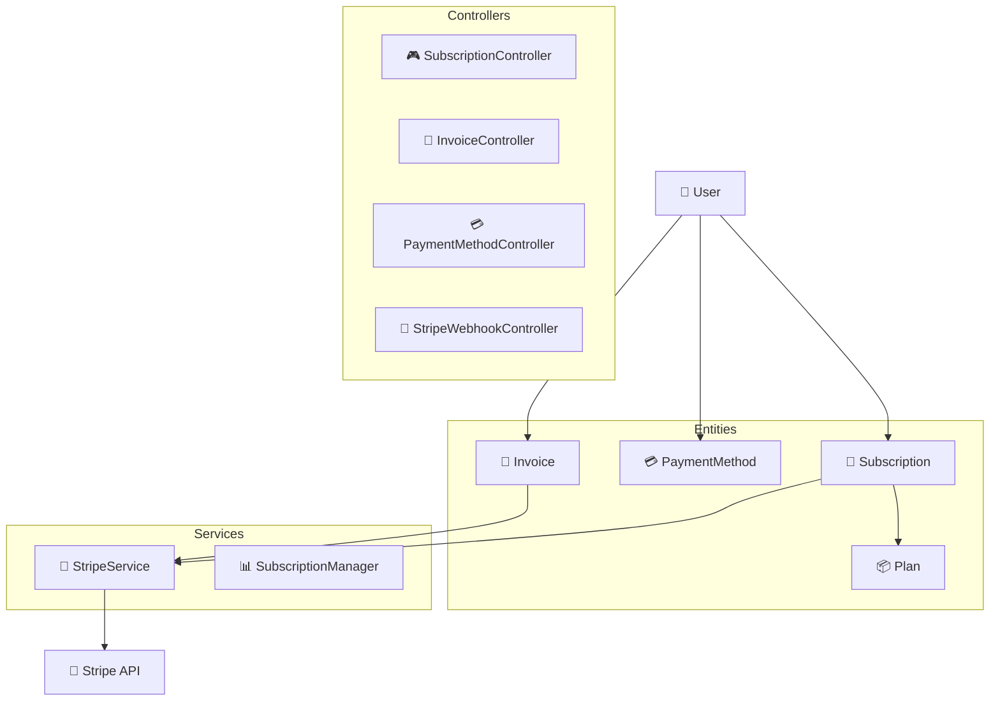
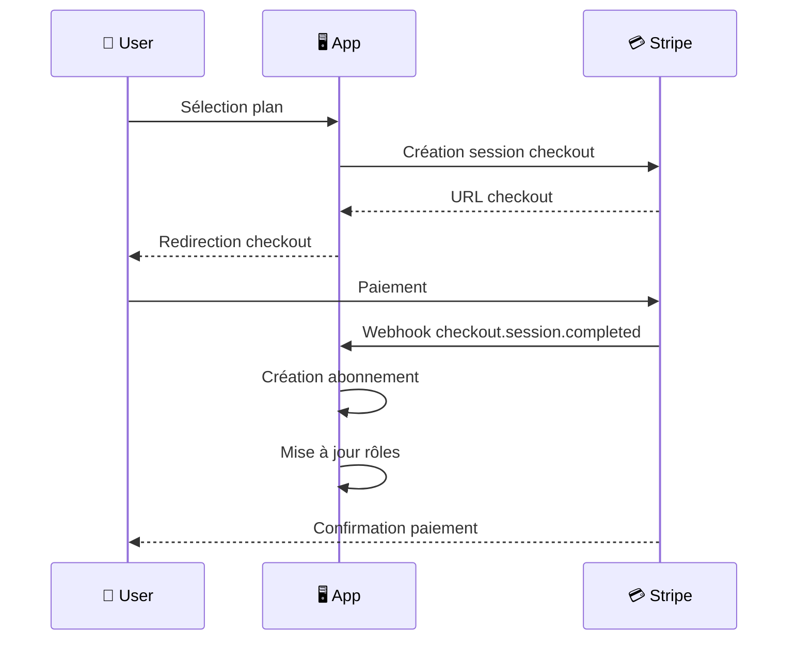

# 💳 Système d'Abonnement et Stripe

Le système d'abonnement de Maker Copilot permet aux utilisateurs de souscrire à différents plans avec intégration sécurisée Stripe.

## 📋 Vue d'ensemble

### Plans Disponibles

| Plan | Prix Mensuel | Prix Annuel | Économies | Produits Max | Rapports Détaillés | Fonctionnalités |
|------|-------------|-------------|-------------|--------------|-------------------|--------------------|
| 🆓 **Starter** | **Gratuit** | **Gratuit** | - | **3** | ❌ | Dashboard basique, Support communautaire |
| 🚀 **Pro** | **5€** | **55€** | **8,3%** | **50** | ✅ | Rapports détaillés, Support prioritaire, 14j d'essai |
| 🌟 **Unlimited** | **10€** | **100€** | **16,7%** | **Illimité** | ✅ | Toutes fonctionnalités, API avancé, Exports illimités |

#### 🎁 Avantages par Plan

**🆓 Starter (Gratuit)**
- ✅ Jusqu'à 3 produits
- ✅ Tableau de bord basique
- ✅ Support communautaire

**🚀 Pro (5€/mois)**
- ✅ Jusqu'à 50 produits
- ✅ Rapports détaillés
- ✅ Support prioritaire
- ✅ 14 jours d'essai gratuit
- ✅ Analytics avancées

**🌟 Unlimited (10€/mois)**
- ✅ Produits illimités
- ✅ Rapports avancés
- ✅ Support premium
- ✅ Accès API avancé
- ✅ Exports illimités
- ✅ 14 jours d'essai gratuit
- ✅ Fonctionnalités exclusives

## 🏗️ Architecture



## 🔧 Entités Principales

### 📦 Plan
- **Slug** : Identifiant unique (starter, pro, unlimited)
- **Prix** : Mensuel et annuel
- **Limites** : Nombre max de produits
- **Fonctionnalités** : Rapports détaillés, etc.

### 📄 Subscription
- **Statuts** : active, canceled, past_due, trialing
- **Périodes** : Dates de début/fin
- **Intégration Stripe** : ID abonnement Stripe

### 📃 Invoice
- **Synchronisation** : Avec les factures Stripe
- **Téléchargement** : PDF et URL hébergée
- **Statuts** : paid, open, void

### 💳 PaymentMethod
- **Types** : Card, autres moyens de paiement
- **Sécurité** : Pas de stockage de données sensibles
- **Gestion** : Ajout/suppression sécurisés

## 🛡️ Sécurité

### Stripe Integration
- ✅ **Clés API** : Séparation test/production
- ✅ **Webhooks** : Validation signature obligatoire
- ✅ **PCI-DSS** : Respect des standards
- ✅ **No Card Storage** : Données chez Stripe uniquement

### Configuration
```yaml
# config/packages/stripe.yaml
parameters:
    stripe.secret_key: '%env(STRIPE_SECRET_KEY)%'
    stripe.publishable_key: '%env(STRIPE_PUBLISHABLE_KEY)%'
    stripe.webhook_secret: '%env(STRIPE_WEBHOOK_SECRET)%'
```

### Variables d'environnement
```bash
# .env
STRIPE_PUBLISHABLE_KEY=pk_test_your_key_here
STRIPE_SECRET_KEY=sk_test_your_key_here
STRIPE_WEBHOOK_SECRET=whsec_your_webhook_secret
```

## 🔐 Système de Rôles

### Hiérarchie des Rôles
```
ROLE_UNLIMITED
    ├── ROLE_PRO
    │   └── ROLE_USER
    └── ROLE_USER
```

### Permissions par Plan
- **Starter** : `ROLE_USER`
- **Pro** : `ROLE_USER`, `ROLE_PRO`
- **Unlimited** : `ROLE_USER`, `ROLE_PRO`, `ROLE_UNLIMITED`

### Voter de Sécurité
```php
// Vérification des permissions
$this->denyAccessUnlessGranted('CREATE_PRODUCT');
$this->denyAccessUnlessGranted('ACCESS_DETAILED_REPORTS');
```

## 📡 API Endpoints

### 📄 Abonnements
```http
GET    /api/subscriptions           # Liste des abonnements
GET    /api/subscriptions/current   # Abonnement actuel
POST   /api/subscriptions/create-checkout  # Créer checkout
POST   /api/subscriptions/{id}/cancel      # Annuler
POST   /api/subscriptions/{id}/change-plan # Changer plan
POST   /api/subscriptions/customer-portal # Portal client
GET    /api/subscriptions/check-limits     # Vérifier limites
```

### 📃 Factures
```http
GET    /api/invoices              # Liste des factures
GET    /api/invoices/{id}         # Détails facture
GET    /api/invoices/{id}/download # Télécharger PDF
POST   /api/invoices/{id}/sync    # Synchroniser
GET    /api/invoices/stats        # Statistiques
```

### 💳 Moyens de Paiement
```http
GET    /api/payment-methods                # Liste
POST   /api/payment-methods               # Ajouter
GET    /api/payment-methods/{id}          # Détails
POST   /api/payment-methods/{id}/set-default # Définir défaut
DELETE /api/payment-methods/{id}          # Supprimer
```

### 🔗 Webhooks Stripe
```http
POST   /stripe/webhook            # Endpoint webhook
```

## ⚡ Webhooks Supportés

- ✅ `checkout.session.completed` - Checkout terminé
- ✅ `customer.subscription.created` - Abonnement créé
- ✅ `customer.subscription.updated` - Abonnement modifié
- ✅ `customer.subscription.deleted` - Abonnement supprimé
- ✅ `invoice.payment_succeeded` - Paiement réussi
- ✅ `invoice.payment_failed` - Paiement échoué
- ✅ `invoice.created` - Facture créée
- ✅ `customer.subscription.trial_will_end` - Fin d'essai

## 🔄 Flux de Souscription



## 📊 Gestion des Limites

### Vérification Automatique
```php
// Avant création produit
if (!$this->subscriptionManager->canCreateProduct($user)) {
    throw new AccessDeniedException('Limite atteinte');
}
```

### API de Vérification
```http
GET /api/subscriptions/check-limits?action=create_product
```

## 🛠️ Services Principaux

### StripeService
- Gestion des customers Stripe
- Création sessions checkout
- Synchronisation données
- Validation webhooks

### SubscriptionManager
- Logique métier abonnements
- Gestion des rôles utilisateur
- Vérification des limites
- Statistiques

## 📈 Monitoring et Logs

Tous les événements importants sont loggés :
- Créations/modifications d'abonnements
- Paiements réussis/échoués
- Erreurs d'intégration Stripe
- Changements de rôles

## 🚀 Déploiement

1. **Configuration Stripe** :
   - Créer account Stripe
   - Configurer webhooks
   - Récupérer clés API

2. **Variables d'environnement** :
   - STRIPE_SECRET_KEY
   - STRIPE_PUBLISHABLE_KEY
   - STRIPE_WEBHOOK_SECRET

3. **Migration base** :
   ```bash
   php bin/console doctrine:migrations:migrate
   ```

4. **Création plans** :
   ```bash
   php bin/console app:create-plans
   ```

## 🔧 Commandes Console

```bash
# Créer les plans Stripe en base de données
php bin/console app:create-stripe-plans

# Créer un utilisateur de test
php bin/console app:create-test-user

# Synchroniser abonnements
php bin/console app:sync-subscriptions

# Synchroniser factures
php bin/console app:sync-invoices

# Nettoyer données expirées
php bin/console app:cleanup-expired-data
```

## 📝 Notes de Développement

- **Tests** : Utiliser les clés de test Stripe
- **Webhooks** : Configurer ngrok pour développement local
- **Logs** : Surveiller les erreurs Stripe
- **Sécurité** : Jamais stocker de données de carte