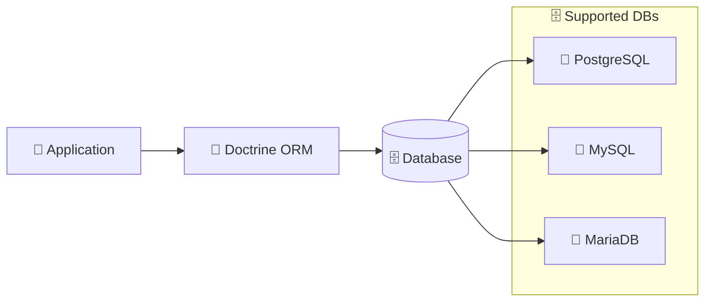
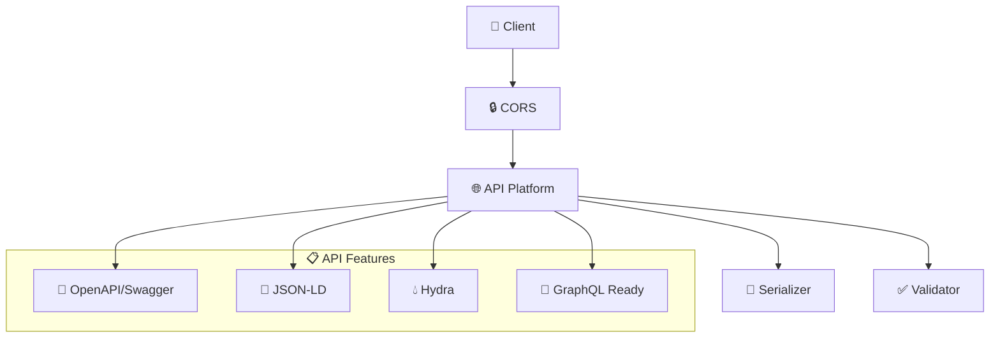
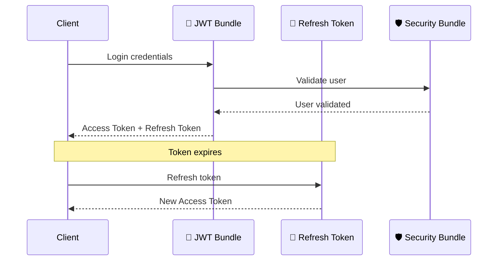
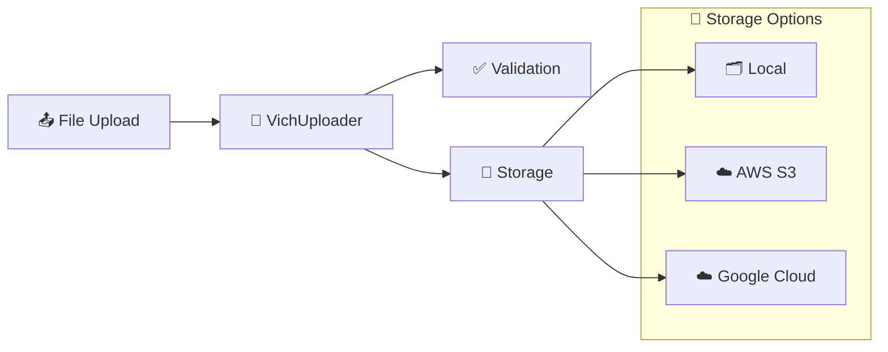
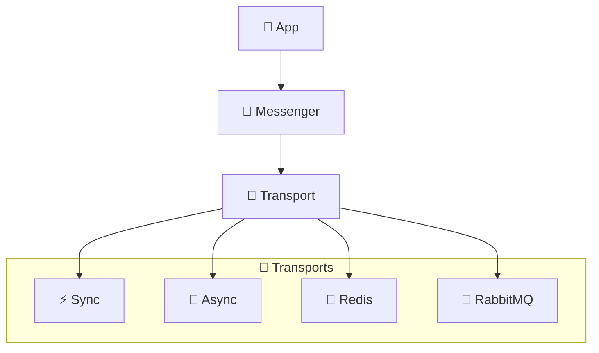
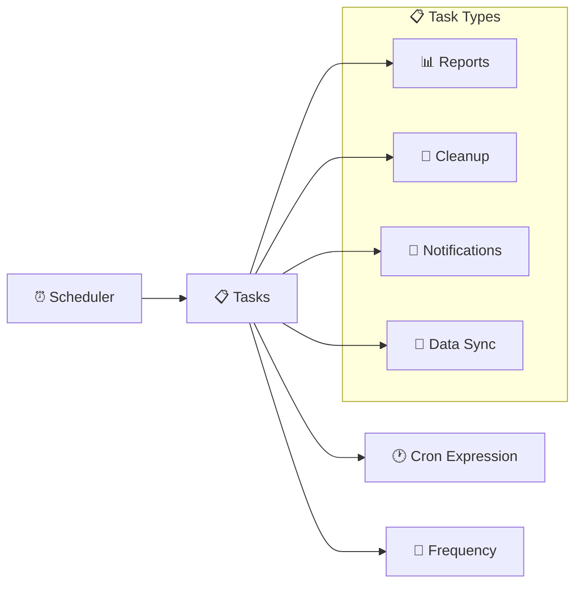
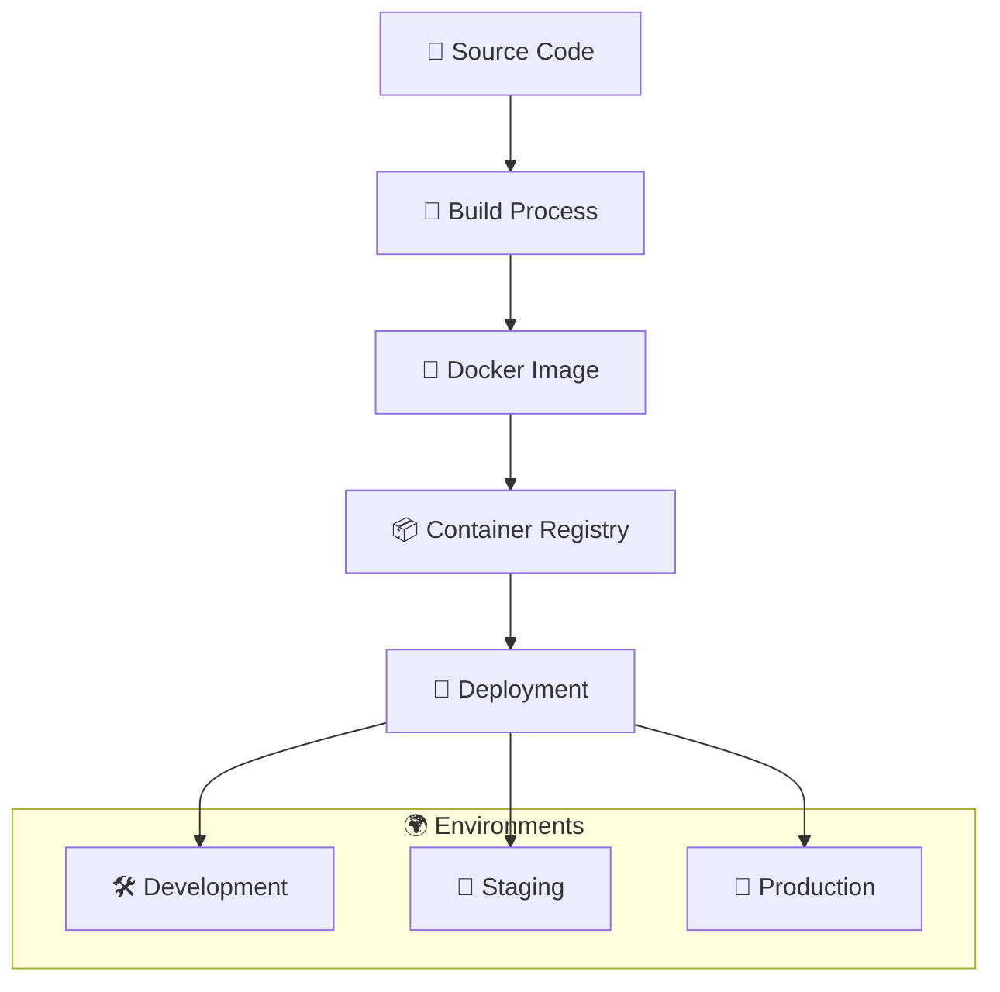
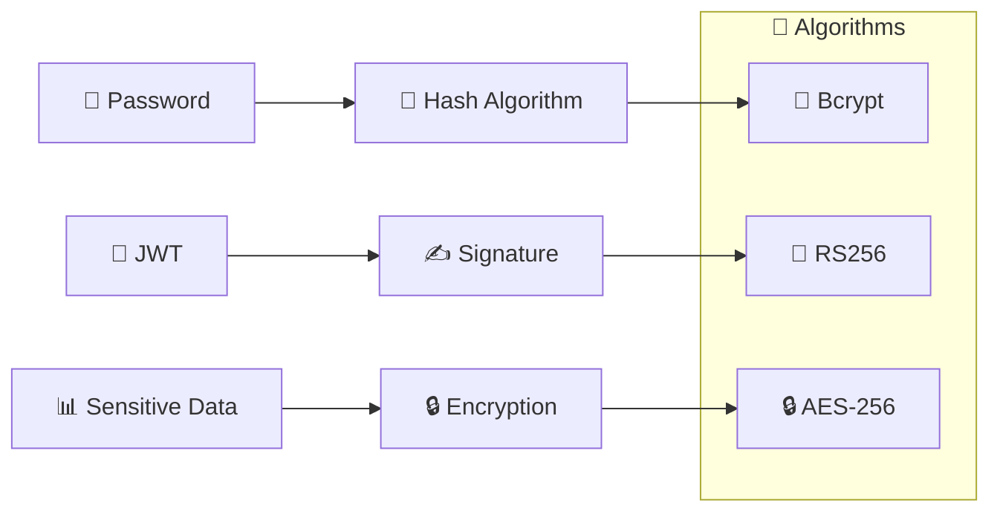

# 🛠️ Stack Technologique - Maker Copilot

## 📋 Vue d'Ensemble

Maker Copilot utilise un **stack moderne et robuste** basé sur l'écosystème Symfony, optimisé pour les performances et la maintenabilité.

## 🎯 Technologies Principales

### 🐘 **Backend - PHP/Symfony**

| Composant | Version | Description | Usage |
|-----------|---------|-------------|-------|
| 🐘 **PHP** | 8.1+ | Langage principal | Runtime de l'application |
| 🎵 **Symfony** | 6.4.* | Framework web | Architecture MVC et services |
| 🌐 **API Platform** | 3.2 | Framework API REST | Génération automatique d'APIs |
| 🗄️ **Doctrine ORM** | 3.2 | ORM/Mapping objet-relationnel | Gestion de la base de données |
| 🔐 **LexikJWTAuth** | 2.21.0 | Authentification JWT | Sécurité et authentification |

### 🗄️ **Base de Données**



### 📧 **Communication & Messaging**

| Service | Package | Description |
|---------|---------|-------------|
| 📧 **Email** | symfony/mailer ^7.1 | Envoi d'emails SMTP |
| 📮 **Messaging** | symfony/messenger | Files d'attente asynchrones |
| 🔔 **Notifications** | symfony/notifier | Notifications multi-canaux |

## 📦 Dépendances Détaillées

### 🏗️ **Core Framework**

```json
{
  "symfony/framework-bundle": "6.4.*",
  "symfony/console": "6.4.*",
  "symfony/dotenv": "6.4.*",
  "symfony/flex": "^2",
  "symfony/runtime": "6.4.*"
}
```

**Pourquoi Symfony 6.4 ?**
- ✅ **LTS (Long Term Support)** - Support jusqu'en 2027
- ⚡ **Performance** - Optimisations significatives
- 🔧 **DX** - Excellente expérience développeur
- 🏗️ **Architecture** - Patterns modernes intégrés

### 🌐 **API & Web Services**



**Packages API :**
```json
{
  "api-platform/core": "^3.2",
  "nelmio/cors-bundle": "^2.5",
  "symfony/serializer": "6.4.*",
  "symfony/validator": "6.4.*",
  "symfony/property-info": "6.4.*"
}
```

### 🔐 **Sécurité & Authentification**



**Packages Sécurité :**
```json
{
  "lexik/jwt-authentication-bundle": "2.21.0",
  "gesdinet/jwt-refresh-token-bundle": "^1.3",
  "symfony/security-bundle": "6.4.*"
}
```

### 📊 **Data & Analytics**

| Package | Usage | Description |
|---------|-------|-------------|
| 📋 **PhpSpreadsheet** | phpoffice/phpspreadsheet ^4.2 | Export Excel/CSV |
| 🔍 **Doctrine Extensions** | doctrine/* | Migrations, DBAL |
| 📊 **Custom Views** | SQL Views | Analytics pré-calculées |

### 🎨 **Templates & Assets**

```json
{
  "twig/twig": "^3.0",
  "symfony/twig-bundle": "^7.1",
  "twig/extra-bundle": "^3.0",
  "symfony/asset": "6.4.*"
}
```

**Templates utilisés :**
- 📧 **Emails** : `templates/email/`
- 🖼️ **Assets** : Gestion via Symfony Asset Component

### 📁 **Upload & Files**



**Package :**
```json
{
  "vich/uploader-bundle": "^2.4"
}
```

## 🔧 Services & Intégrations

### 📮 **Queue & Background Jobs**



**Configuration :**
```json
{
  "symfony/messenger": "6.4.*",
  "symfony/doctrine-messenger": "6.4.*"
}
```

### 📊 **Monitoring & Observabilité**

| Service | Package | Description |
|---------|---------|-------------|
| 🔍 **Sentry** | sentry/sentry-symfony ^5.2 | Error tracking et monitoring |
| 📋 **Monolog** | symfony/monolog-bundle ^3.0 | Logging avancé |
| 📊 **Messenger Monitor** | zenstruck/messenger-monitor-bundle ^0.4.0 | Monitoring des queues |

### ⏰ **Tâches Programmées**



**Package :**
```json
{
  "symfony/scheduler": "^6.1",
  "dragonmantank/cron-expression": "^3.4"
}
```

## 🧪 Testing & Qualité

### 🧪 **Framework de Tests**

```json
{
  "phpunit/phpunit": "^9.5",
  "symfony/phpunit-bridge": "^7.1",
  "symfony/browser-kit": "6.4.*",
  "symfony/css-selector": "6.4.*"
}
```

### 🔍 **Outils de Développement**

| Outil | Package | Description |
|-------|---------|-------------|
| 🛠️ **Maker Bundle** | symfony/maker-bundle ^1.50 | Génération de code |
| 🐛 **Debug Bundle** | symfony/debug-bundle 6.4.* | Debugging |
| 📊 **Web Profiler** | symfony/web-profiler-bundle 6.4.* | Profiling |
| ⏱️ **Stopwatch** | symfony/stopwatch 6.4.* | Performance monitoring |

## 🌍 **Internationalisation**

```json
{
  "symfony/translation": "6.4.*",
  "symfony/intl": "6.4.*"
}
```

**Langues supportées :**
- 🇫🇷 **Français** (principal)
- 🇬🇧 **Anglais** (à venir)

## 📦 **Build & Déploiement**

### 🐳 **Containerisation**



### ⚙️ **Configuration par Environnement**

```bash
# Développement
.env.local              # Variables locales
var/cache/dev/          # Cache dev
var/log/dev.log         # Logs debug

# Production
.env.prod               # Variables production
var/cache/prod/         # Cache optimisé
var/log/prod.log        # Logs erreurs
```

## 🚀 **Performance**

### ⚡ **Optimisations**

1. **🗄️ ORM** : Lazy loading, eager loading configuré
2. **📊 Cache** : Cache APCu, Redis pour les sessions
3. **🔄 HTTP** : Cache HTTP, ETags
4. **📱 API** : Pagination, filtres, sérialisation optimisée

### 📊 **Métriques Typiques**

| Métrique | Valeur | Contexte |
|----------|--------|----------|
| 🚀 **Temps de réponse** | < 200ms | API simple |
| 💾 **Utilisation mémoire** | < 128MB | Par requête |
| 🔄 **Throughput** | 100+ req/s | Serveur standard |
| 📊 **Cache hit ratio** | > 80% | Données fréquentes |

## 🛡️ **Sécurité**

### 🔒 **Standards Suivis**

- **OWASP Top 10** - Protection contre les vulnérabilités courantes
- **PSR-12** - Standards de codage PHP
- **JWT Best Practices** - Gestion sécurisée des tokens
- **GDPR Compliance** - Protection des données personnelles

### 🔐 **Chiffrement & Hashing**



## 📊 **Métriques du Stack**

| Composant | Lignes de Code | Complexité | Maintenance |
|-----------|---------------|-------------|-------------|
| 🎮 **Controllers** | ~1,500 | Faible | ✅ Facile |
| 🏷️ **Entities** | ~2,000 | Moyenne | ✅ Stable |
| 🔧 **Services** | ~1,200 | Moyenne | ✅ Modulaire |
| 📊 **Tests** | ~800 | Faible | ⚠️ À améliorer |

---

> 💡 **Recommandation** : Ce stack est optimisé pour le **développement rapide** et la **maintenabilité long terme**. Chaque technologie a été choisie pour sa **robustesse** et son **écosystème mature**.