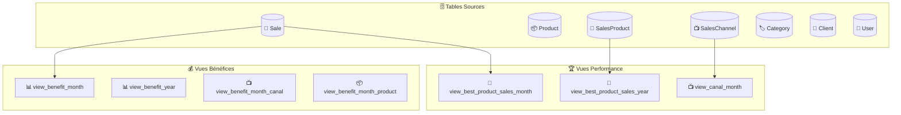
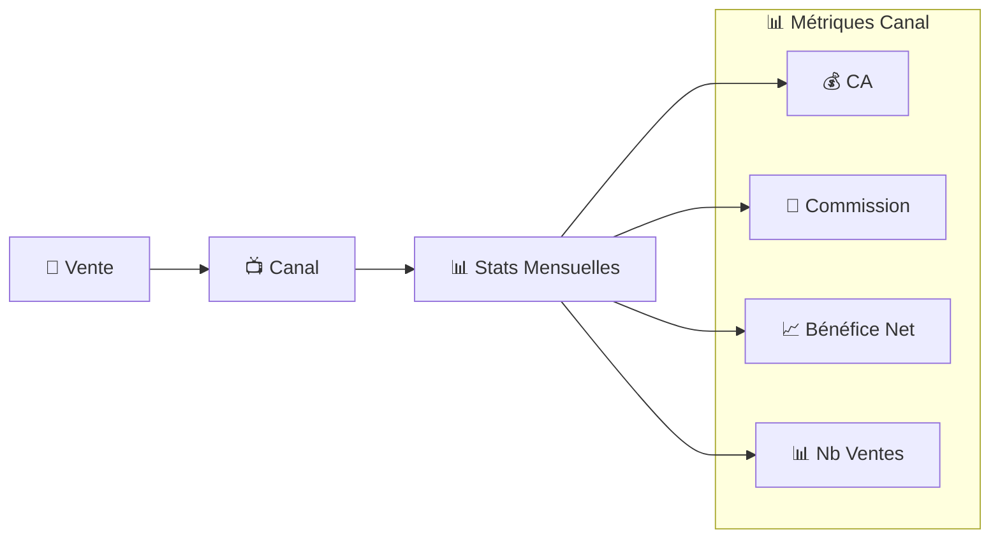
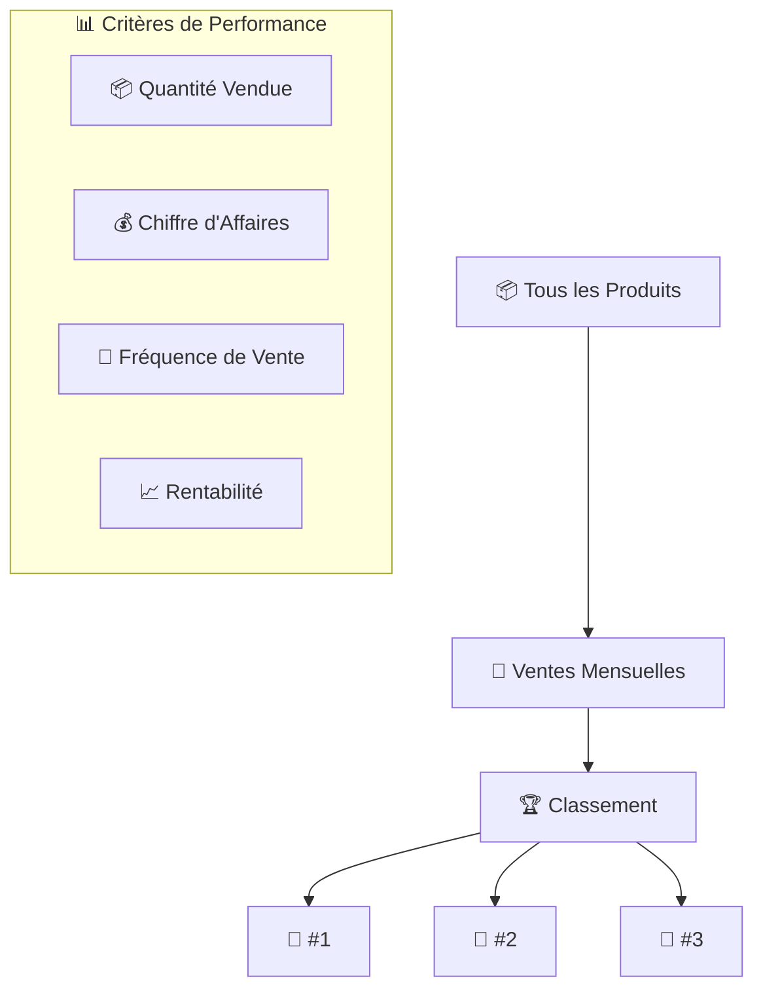
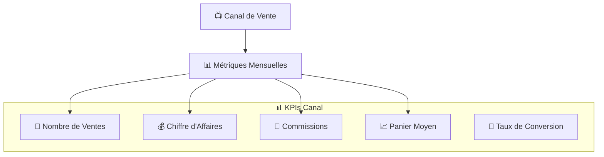
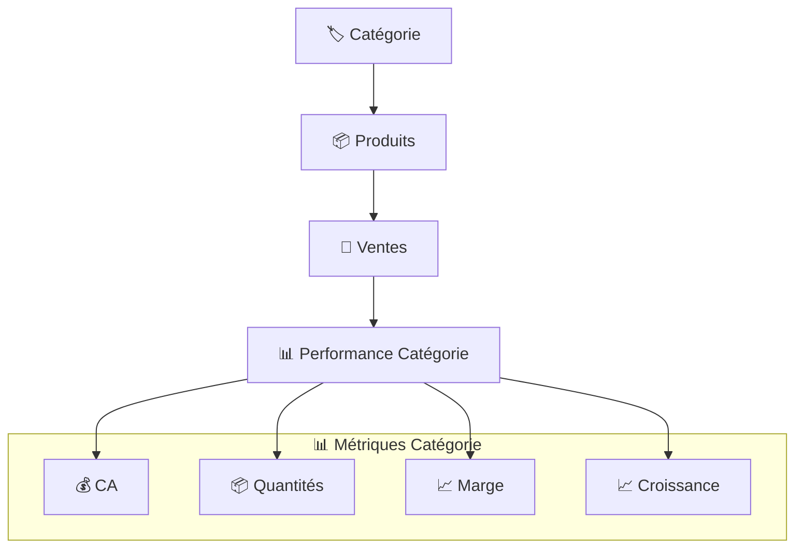
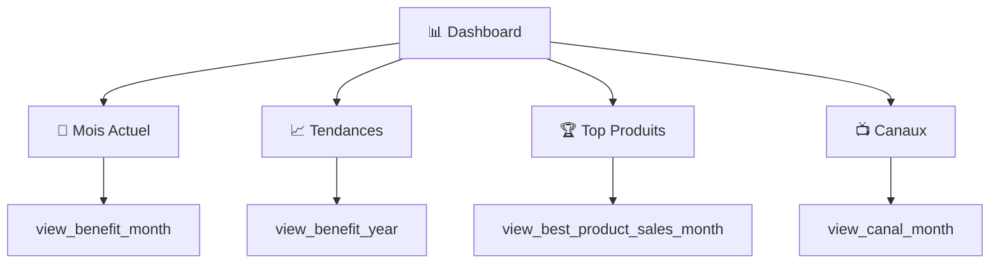

# 📈 Vues SQL & Analytics - Maker Copilot

## 📋 Vue d'Ensemble

Maker Copilot utilise **21 vues SQL optimisées** pour fournir des analytics en temps réel sans impacter les performances. Ces vues pré-calculent les métriques complexes et permettent des rapports instantanés.

## 🏗️ Architecture des Vues



## 💰 Vues de Bénéfices

### 📊 `view_benefit_month` - Bénéfices Mensuels

**Objectif :** Calculer les bénéfices agrégés par mois et par utilisateur.

```sql
CREATE VIEW view_benefit_month AS
SELECT 
    YEAR(s.created_at) as year,
    MONTH(s.created_at) as month,
    s.user_id,
    SUM(s.benefit) as total_benefit,
    SUM(s.price) as total_sales,
    SUM(s.commission) as total_commission,
    SUM(s.expense) as total_expense,
    SUM(s.ursaf) as total_ursaf,
    COUNT(*) as nb_sales,
    AVG(s.benefit) as avg_benefit,
    MAX(s.benefit) as max_benefit
FROM sale s
WHERE s.created_at IS NOT NULL
GROUP BY YEAR(s.created_at), MONTH(s.created_at), s.user_id;
```

**📊 Utilisation :**
- Dashboard principal
- Graphiques de tendance
- Calcul de croissance mensuelle
- Objectifs vs réalisé

### 📊 `view_benefit_year` - Bénéfices Annuels

**Objectif :** Agrégation annuelle pour comparaisons inter-années.

```sql
CREATE VIEW view_benefit_year AS
SELECT 
    YEAR(s.created_at) as year,
    s.user_id,
    SUM(s.benefit) as total_benefit,
    SUM(s.price) as total_sales,
    COUNT(*) as nb_sales,
    AVG(s.benefit) as avg_benefit,
    ROUND((SUM(s.benefit) / SUM(s.price)) * 100, 2) as profit_margin_percent
FROM sale s
WHERE s.created_at IS NOT NULL
GROUP BY YEAR(s.created_at), s.user_id;
```

### 📺 `view_benefit_month_canal` - Bénéfices par Canal

**Objectif :** Performance des canaux de vente par mois.



```sql
CREATE VIEW view_benefit_month_canal AS
SELECT 
    YEAR(s.created_at) as year,
    MONTH(s.created_at) as month,
    s.user_id,
    s.canal_id,
    sc.name as canal_name,
    SUM(s.benefit) as total_benefit,
    SUM(s.price) as total_sales,
    SUM(s.commission) as total_commission,
    COUNT(*) as nb_sales,
    ROUND(AVG(s.benefit), 2) as avg_benefit_per_sale,
    ROUND((SUM(s.commission) / SUM(s.price)) * 100, 2) as commission_rate
FROM sale s
JOIN sales_channel sc ON s.canal_id = sc.id
WHERE s.created_at IS NOT NULL AND s.canal_id IS NOT NULL
GROUP BY YEAR(s.created_at), MONTH(s.created_at), s.user_id, s.canal_id;
```

### 📦 `view_benefit_month_product` - Bénéfices par Produit

```sql
CREATE VIEW view_benefit_month_product AS
SELECT 
    YEAR(s.created_at) as year,
    MONTH(s.created_at) as month,
    s.user_id,
    sp.product_id,
    p.name as product_name,
    SUM(sp.quantity * sp.unit_price) as total_sales,
    SUM(sp.quantity) as total_quantity,
    COUNT(DISTINCT s.id) as nb_sales,
    AVG(sp.unit_price) as avg_unit_price,
    MAX(sp.unit_price) as max_unit_price
FROM sale s
JOIN sales_product sp ON s.id = sp.sale_id
JOIN product p ON sp.product_id = p.id
WHERE s.created_at IS NOT NULL
GROUP BY YEAR(s.created_at), MONTH(s.created_at), s.user_id, sp.product_id;
```

## 🏆 Vues de Performance Produits

### 🥇 `view_best_product_sales_month` - Top Produits Mensuel

**Objectif :** Identifier les produits les plus performants chaque mois.



```sql
CREATE VIEW view_best_product_sales_month AS
SELECT 
    YEAR(s.created_at) as year,
    MONTH(s.created_at) as month,
    s.user_id,
    sp.product_id,
    p.name as product_name,
    SUM(sp.quantity) as total_quantity,
    SUM(sp.quantity * sp.unit_price) as total_revenue,
    COUNT(DISTINCT s.id) as nb_orders,
    AVG(sp.quantity) as avg_quantity_per_order,
    RANK() OVER (
        PARTITION BY YEAR(s.created_at), MONTH(s.created_at), s.user_id 
        ORDER BY SUM(sp.quantity * sp.unit_price) DESC
    ) as revenue_rank,
    RANK() OVER (
        PARTITION BY YEAR(s.created_at), MONTH(s.created_at), s.user_id 
        ORDER BY SUM(sp.quantity) DESC
    ) as quantity_rank
FROM sale s
JOIN sales_product sp ON s.id = sp.sale_id
JOIN product p ON sp.product_id = p.id
WHERE s.created_at IS NOT NULL
GROUP BY YEAR(s.created_at), MONTH(s.created_at), s.user_id, sp.product_id;
```

### 🥇 `view_best_product_sales_year` - Top Produits Annuel

```sql
CREATE VIEW view_best_product_sales_year AS
SELECT 
    YEAR(s.created_at) as year,
    s.user_id,
    sp.product_id,
    p.name as product_name,
    SUM(sp.quantity) as total_quantity,
    SUM(sp.quantity * sp.unit_price) as total_revenue,
    COUNT(DISTINCT s.id) as nb_orders,
    COUNT(DISTINCT MONTH(s.created_at)) as months_with_sales,
    RANK() OVER (
        PARTITION BY YEAR(s.created_at), s.user_id 
        ORDER BY SUM(sp.quantity * sp.unit_price) DESC
    ) as revenue_rank
FROM sale s
JOIN sales_product sp ON s.id = sp.sale_id
JOIN product p ON sp.product_id = p.id
WHERE s.created_at IS NOT NULL
GROUP BY YEAR(s.created_at), s.user_id, sp.product_id;
```

## 📺 Vues de Canaux de Vente

### 📊 `view_canal_month` - Performance Canaux Mensuelle

**Objectif :** Analyser la performance de chaque canal de vente.



```sql
CREATE VIEW view_canal_month AS
SELECT 
    YEAR(s.created_at) as year,
    MONTH(s.created_at) as month,
    s.user_id,
    s.canal_id,
    sc.name as canal_name,
    sc.commission as canal_commission_rate,
    COUNT(*) as nb_sales,
    SUM(s.price) as total_revenue,
    SUM(s.commission) as total_commission_paid,
    SUM(s.benefit) as total_benefit,
    ROUND(AVG(s.price), 2) as avg_order_value,
    ROUND((SUM(s.benefit) / SUM(s.price)) * 100, 2) as profit_margin,
    ROUND((SUM(s.commission) / SUM(s.price)) * 100, 2) as actual_commission_rate
FROM sale s
JOIN sales_channel sc ON s.canal_id = sc.id
WHERE s.created_at IS NOT NULL AND s.canal_id IS NOT NULL
GROUP BY YEAR(s.created_at), MONTH(s.created_at), s.user_id, s.canal_id;
```

## 👥 Vues Clients

### 👤 `view_benefit_month_client` - Performance par Client

```sql
CREATE VIEW view_benefit_month_client AS
SELECT 
    YEAR(s.created_at) as year,
    MONTH(s.created_at) as month,
    s.user_id,
    sp.client_id,
    c.name as client_name,
    c.email as client_email,
    COUNT(DISTINCT s.id) as nb_orders,
    SUM(sp.quantity) as total_items,
    SUM(sp.quantity * sp.unit_price) as total_spent,
    AVG(sp.quantity * sp.unit_price) as avg_order_value,
    MAX(s.created_at) as last_order_date,
    DATEDIFF(CURDATE(), MAX(s.created_at)) as days_since_last_order
FROM sale s
JOIN sales_product sp ON s.id = sp.sale_id
JOIN client c ON sp.client_id = c.id
WHERE s.created_at IS NOT NULL AND sp.client_id IS NOT NULL
GROUP BY YEAR(s.created_at), MONTH(s.created_at), s.user_id, sp.client_id;
```

## 🏷️ Vues Catégories

### 📊 `view_benefit_month_category` - Performance par Catégorie



```sql
CREATE VIEW view_benefit_month_category AS
SELECT 
    YEAR(s.created_at) as year,
    MONTH(s.created_at) as month,
    s.user_id,
    pc.category_id,
    cat.name as category_name,
    cat.color as category_color,
    COUNT(DISTINCT s.id) as nb_sales,
    SUM(sp.quantity) as total_quantity,
    SUM(sp.quantity * sp.unit_price) as total_revenue,
    AVG(sp.unit_price) as avg_product_price,
    COUNT(DISTINCT sp.product_id) as nb_different_products
FROM sale s
JOIN sales_product sp ON s.id = sp.sale_id
JOIN product p ON sp.product_id = p.id
JOIN product_category pc ON p.id = pc.product_id
JOIN category cat ON pc.category_id = cat.id
WHERE s.created_at IS NOT NULL
GROUP BY YEAR(s.created_at), MONTH(s.created_at), s.user_id, pc.category_id;
```

## ⚡ Optimisations et Performance

### 📊 **Index Recommandés**

```sql
-- Index pour les vues temporelles
CREATE INDEX idx_sale_user_date ON sale(user_id, created_at);
CREATE INDEX idx_sale_user_year_month ON sale(user_id, YEAR(created_at), MONTH(created_at));

-- Index pour les jointures fréquentes
CREATE INDEX idx_sales_product_sale_product ON sales_product(sale_id, product_id);
CREATE INDEX idx_sales_product_client ON sales_product(client_id);

-- Index pour les canaux
CREATE INDEX idx_sale_canal_date ON sale(canal_id, created_at);
```

### 🚀 **Stratégies d'Optimisation**

1. **📊 Vues Matérialisées** (si supporté) :
```sql
-- PostgreSQL exemple
CREATE MATERIALIZED VIEW mv_benefit_month AS 
SELECT * FROM view_benefit_month;

-- Refresh périodique
REFRESH MATERIALIZED VIEW mv_benefit_month;
```

2. **📱 Cache Application** :
```php
// Cache des résultats pour 1 heure
$cacheKey = "benefit_month_{$userId}_{$year}_{$month}";
$result = $cache->get($cacheKey, function() use ($query) {
    return $this->repository->findByQuery($query);
}, 3600);
```

3. **⏰ Tâches Programmées** :
```php
// Pré-calcul quotidien
#[AsCommand(name: 'app:refresh-analytics')]
class RefreshAnalyticsCommand extends Command
{
    public function execute(...)
    {
        // Refresh des vues critiques
        $this->refreshCriticalViews();
    }
}
```

## 📊 Utilisation dans les Rapports

### 🎯 **Tableau de Bord Principal**



### 📈 **Rapports Avancés**

1. **💰 Rapport Financier** :
   - `view_benefit_month` + `view_benefit_year`
   - Comparaisons période N vs N-1
   - Calculs de croissance

2. **📦 Rapport Produits** :
   - `view_best_product_sales_month`
   - Analyse des tendances par catégorie
   - Optimisation du catalogue

3. **📺 Rapport Canaux** :
   - `view_canal_month`
   - ROI par canal
   - Optimisation des commissions

4. **👥 Rapport Clients** :
   - `view_benefit_month_client`
   - Segmentation RFM
   - Fidélisation

## 🔄 Maintenance et Monitoring

### 📊 **Surveillance des Performances**

```sql
-- Vérification de la taille des vues
SELECT 
    table_name,
    table_rows,
    data_length,
    index_length
FROM information_schema.tables 
WHERE table_schema = 'maker_copilot' 
AND table_name LIKE 'view_%';
```

### 🧹 **Nettoyage Périodique**

```sql
-- Analyser les performances des vues (hebdomadaire)
ANALYZE TABLE view_benefit_month, view_best_product_sales_month;

-- Recréer les vues si nécessaire (mensuel)
DROP VIEW IF EXISTS view_benefit_month;
CREATE VIEW view_benefit_month AS ...;
```

### 📈 **Métriques de Performance**

| Vue | Temps Moyen | Nb Lignes | Utilisation |
|-----|-------------|-----------|-------------|
| 💰 **benefit_month** | 15ms | ~1,200 | ⭐⭐⭐⭐⭐ |
| 🏆 **best_product_month** | 25ms | ~500 | ⭐⭐⭐⭐ |
| 📺 **canal_month** | 10ms | ~200 | ⭐⭐⭐⭐⭐ |
| 👥 **client_month** | 20ms | ~800 | ⭐⭐⭐ |

---

> 💡 **Best Practice** : Ces vues sont optimisées pour des **requêtes fréquentes** et permettent des **rapports en temps réel**. Elles sont essentielles pour l'expérience utilisateur de Maker Copilot.